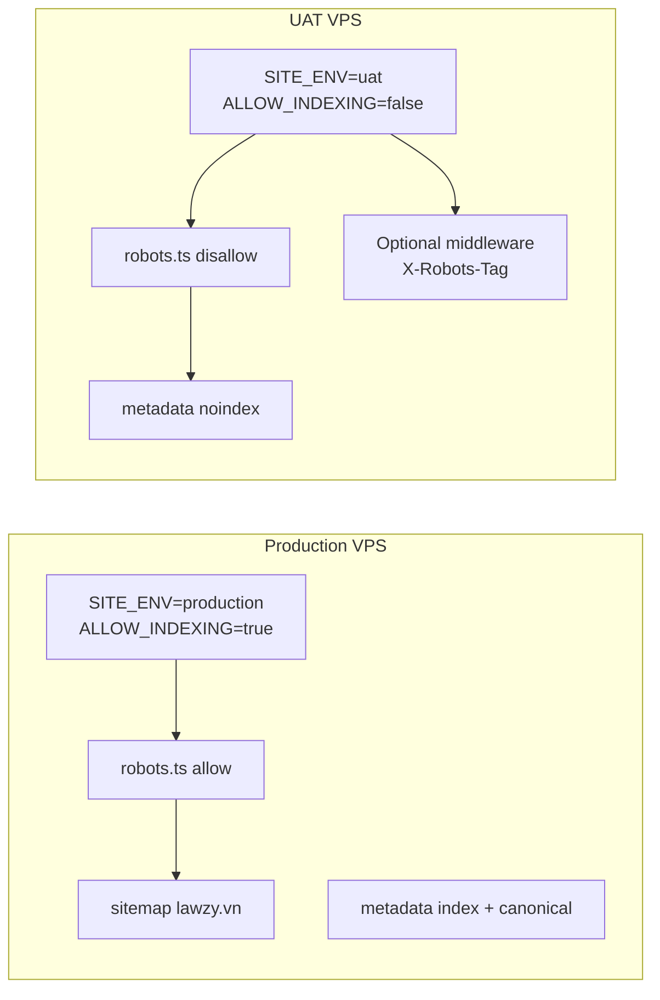

# Technical SEO cho Next.js (landing + chặn UAT index)

## Bối cảnh từ codebase

- [frontend/src/app/layout.tsx](frontend/src/app/layout.tsx) đã dùng **Metadata API** với `metadataBase: new URL(process.env.NEXT_PUBLIC_APP_URL || 'http://localhost:3000')`, `alternates.canonical: "/"`, `openGraph`, `twitter`, `robots: { index: true }`.
- **Không có** [`robots.ts`](https://nextjs.org/docs/app/api-reference/file-conventions/metadata/robots) / [`sitemap.ts`](https://nextjs.org/docs/app/api-reference/file-conventions/metadata/sitemap) trong `src/app/`.
- Trang chủ marketing [frontend/src/app/(landing)/page.tsx](frontend/src/app/(landing)/page.tsx) là **`"use client"`** toàn phần; các section (hero, blog, …) cũng client — bot vẫn thấy HTML ban đầu nhưng **nội dung chữ chính phụ thuộc client** (qua `language-provider`), dễ không nhất quán với snippet / đa ngôn ngữ so với metadata tĩnh.
- Có sẵn fetch server cho tin: [frontend/src/lib/articles-server.ts](frontend/src/lib/articles-server.ts) (`fetchNewsList`, `fetchArticleBySlug`) — dùng được cho **sitemap tin** và/hoặc **generateMetadata** cho `/news/[slug]`.

## Nguyên nhân khả dĩ UAT lên Google (theo ảnh + cấu hình hiện tại)

1. **`NEXT_PUBLIC_APP_URL` trên VPS UAT** trỏ `https://uat.lawzy.vn` → `metadataBase` và URL OG/relative resolve theo **origin UAT**, Google coi là site hợp lệ để index.
2. **Không có** `robots.txt` động / `noindex` theo môi trường → crawler được phép index toàn bộ route public (register, term, …).
3. Trang **register / term** có thể là Server Component hoặc metadata rõ → sitelink tiếng Anh (ảnh 2) khớp với route dashboard/auth dùng metadata khác ngôn ngữ landing.

## Chiến lược tách Production vs UAT (branch deploy VPS)

Vì **production và UAT là hai VPS / hai bộ env** (không phải Vercel Preview), cách ổn định nhất là **biến môi trường rõ ràng**, không chỉ dựa vào URL:

- Thêm ví dụ: `NEXT_PUBLIC_SITE_ENV=production` trên prod, `NEXT_PUBLIC_SITE_ENV=uat` (hoặc `staging`) trên UAT.
- Trên **UAT only**: `NEXT_PUBLIC_ALLOW_ROBOT_INDEXING=false` (hoặc tương đương).

Hành vi mong muốn:

| Môi trường | `robots.ts` | Meta `robots` / OG canonical |
|-----------|-------------|------------------------------|
| UAT | `Disallow: /` (hoặc disallow toàn site) | `noindex, nofollow` |
| Production | `Allow` + `Sitemap: https://lawzy.vn/sitemap.xml` | `index, follow` + canonical luôn `https://lawzy.vn` + path |

**Lưu ý triển khai:** `robots.ts` / `sitemap.ts` trong App Router có thể `export default async function` và đọc `process.env` (build/runtime tùy deploy). Với Docker/VPS, đảm bảo env được inject **lúc build** nếu dùng static optimization, hoặc dùng runtime config nhất quán với cách deploy hiện tại ([frontend/Dockerfile](frontend/Dockerfile) đã truyền `NEXT_PUBLIC_APP_URL`).

**Tuỳ chọn bổ sung (defense in depth):** thêm [Next.js Middleware](https://nextjs.org/docs/app/building-your-application/routing/middleware) ở [frontend/src/middleware.ts](frontend/src/middleware.ts) (file mới): nếu `Host` chứa `uat.` thì set header `X-Robots-Tag: noindex, nofollow` cho mọi response — hỗ trợ khi env bị cấu hình sai.

## Phần 1 — Chặn index UAT + canonical production (ưu tiên cao)

1. **Tài liệu env** ([frontend/README.md](frontend/README.md)): bảng biến cho Prod vs UAT (`NEXT_PUBLIC_APP_URL`, `NEXT_PUBLIC_SITE_ENV`, `NEXT_PUBLIC_ALLOW_ROBOT_INDEXING`).
2. **`src/app/robots.ts`**:  
   - Nếu `ALLOW_ROBOT_INDEXING === false` hoặc `SITE_ENV !== production` → `disallow: ["/"]`.  
   - Ngược lại → `allow: "/"`, `sitemap: "https://lawzy.vn/sitemap.xml"` (URL tuyệt đối production, không phụ thuộc `NEXT_PUBLIC_APP_URL` của UAT).
3. **`src/app/sitemap.ts`**:  
   - Chỉ trả về URL **production** (`https://lawzy.vn`) khi build cho prod; trên UAT có thể trả `[]` hoặc cùng logic nhưng robots đã chặn.  
   - Liệt kê route tĩnh: `/`, `/pricing`, `/contact`, `/news`, `/products/clm`, `/products/lpms`, `/term`, `/privacy-policy`, …  
   - Tin động: gọi `fetchNewsList` (paginate theo `totalPages` hoặc limit an toàn) → `/news/[slug]`.
4. **Root metadata** ([frontend/src/app/layout.tsx](frontend/src/app/layout.tsx)):  
   - Tách hoặc bổ sung `generateMetadata` async (nếu cần) để khi UAT: `robots: { index: false, follow: false }`.  
   - Trên production: đặt `metadataBase` và `alternates.canonical` nhất quán với `https://lawzy.vn` (có thể tách `NEXT_PUBLIC_CANONICAL_ORIGIN` nếu muốn tách “URL app” vs “URL SEO” — chỉ khi thật sự cần).

## Phần 2 — Metadata theo route (landing + news)

1. **`(landing)/layout.tsx`**: hiện chỉ bọc `LandingLanguageProvider` — có thể thêm **`export const metadata`** chung (default title/description cho nhóm landing) hoặc để từng `page.tsx` override.
2. **Từng trang** trong [frontend/src/app/(landing)/](frontend/src/app/(landing)/): bổ sung `export const metadata` hoặc `generateMetadata` (contact, pricing, products, term, privacy) với **title/description/OG/twitter** tiếng Việt (và sau này `alternates.languages` nếu có locale URL).
3. **`news/[slug]/page.tsx`**: đã có `generateMetadata` server — mở rộng **OG image** (nếu có `coverImage`), `twitter`, `canonical` đúng path `/news/slug`.

## Phần 3 — SSR/SSG cho nội dung SEO quan trọng

1. **Trang chủ** [frontend/src/app/(landing)/page.tsx](frontend/src/app/(landing)/page.tsx):  
   - Refactor theo hướng: **Server Component** làm shell (`<main>`, sections tĩnh, JSON-LD); tách phần cần hook (survey hash, modal) vào một client component nhỏ (`LandingHomeClient.tsx`).  
   - Copy hero/subtitle cho **locale mặc định** (vi) render server (đọc từ file JSON i18n hoặc duplicate tối thiểu) để H1/p không phụ thuộc hydration; client chỉ đổi ngôn ngữ khi user switch.
2. **Các section marketing** nặng client: lộ trình từng bước (blog cards có thể server-fetch list 3 bài + pass props xuống client nhẹ).

## Phần 4 — Image, CWV, font

1. Rà soát [frontend/src/components/landing/](frontend/src/components/landing/) và `(landing)/`: thay `` (nếu có) bằng `next/image`; hero: `priority`, kích thước/`sizes` cố định; placeholder blur chỉ khi có `blurDataURL` hoặc static import — không bắt buộc mọi ảnh.
2. **CLS**: các khối media dùng `aspect-*` + width/height đã có thì giữ.
3. **Font**: đã dùng `next/font` (Geist) trong root layout — ghi chú trong checklist: subset/latin-ext nếu cần tiếng Việt đầy đủ.

## Phần 5 — Semantic HTML + heading

1. Chuẩn hoá: mỗi trang **một `h1`**; landing home: `h1` trong hero (server sau refactor).  
2. Thay bọc `div` vô nghĩa bằng `<main>`, `<section>`, `<article>`, `<header>`, `<footer>` trong layout landing và các page tương ứng (header/footer component có thể render `<header>` / `<footer>`).

## Phần 6 — JSON-LD (Schema.org)

1. Thêm component ví dụ `frontend/src/components/seo/organization-json-ld.tsx` (server): inject `<script type="application/ld+json">` với **Organization** + **WebSite** (`url: https://lawzy.vn`, `potentialAction` SearchAction nếu có search).  
2. Trang tin: **Article** / **NewsArticle** + **BreadcrumbList** (đường dẫn Home → News → Bài viết).  
3. Gắn vào `(landing)/layout.tsx` hoặc từng page để tránh trùng schema.

## Phần 7 — Internal linking & breadcrumbs

1. Rà soát `<a href="/...">` trong landing → `next/link` (đã phần lớn dùng `Link`).  
2. Breadcrumb UI + JSON-LD cho `/news/[slug]`, `/products/clm`, `/products/lpms` (tuỳ UX).

## Phần 8 — Hậu kiểm (ngoài code)

- Google Search Console: **Remove URLs** cho `uat.lawzy.vn` (tạm), sau đó **Validate** robots/noindex.  
- Đảm bảo DNS UAT không trỏ nhầm sang prod và ngược lại.

## Rủi ro / phạm vi

- Refactor home từ full client sang server shell là **thay đổi kiến trúc** — nên làm theo phase sau khi chặn index UAT đã lên production.  
- `sitemap.ts` gọi API nhiều trang: cần giới hạn số URL mỗi lần hoặc `revalidate` hợp lý để tránh timeout build.

