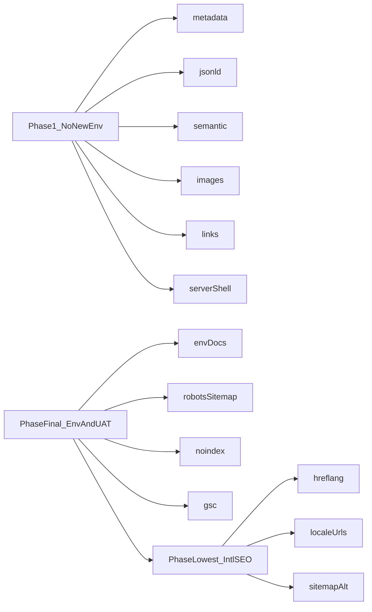

# Technical SEO — Lawzy landing (đã chỉnh theo ưu tiên của bạn)

## Quyết định ưu tiên (theo yêu cầu)

- **Giai đoạn 1 — Làm và commit trước:** mọi thứ **không cần** thêm biến môi trường mới (`SITE_ENV`, `ALLOW_ROBOT_INDEXING`, …). Dùng được `metadataBase` / `NEXT_PUBLIC_APP_URL` **đã có** trong [frontend/src/app/layout.tsx](frontend/src/app/layout.tsx) và [frontend/README.md](frontend/README.md) nếu cần URL tuyệt đối cho OG/canonical trong từng route.
- **Giai đoạn cuối — Chưa thực hiện cho đến khi có env:** toàn bộ nhánh **phân tách Prod vs UAT** (tài liệu env mới, `robots.ts` / `sitemap.ts` phụ thuộc env, `noindex` root theo UAT, cập nhật Dockerfile/VPS). Đây là bước bạn xác nhận sẽ làm **sau**.
- **Giai đoạn trì hoãn — Ưu tiên thấp nhất:** SEO **đa ngôn ngữ / quốc tế** (URL theo locale, `hreflang`, metadata & nội dung EN, sitemap đa locale). Chi tiết checklist ở cuối file.

---

## Bối cảnh codebase (không đổi)

- Root đã có **Metadata API**: [frontend/src/app/layout.tsx](frontend/src/app/layout.tsx).
- Chưa có `src/app/robots.ts` / `src/app/sitemap.ts`.
- [frontend/src/app/(landing)/page.tsx](frontend/src/app/(landing)/page.tsx): server `metadata` + `LandingHomeClient` (survey hash); nội dung hero vẫn chủ yếu client qua i18n — **đa ngôn ngữ SEO** cần URL locale (mục “ưu tiên thấp nhất”).
- Server fetch tin: [frontend/src/lib/articles-server.ts](frontend/src/lib/articles-server.ts).

---

## Giai đoạn 1 — Triển khai ngay (không thêm env)

### 1. Metadata theo route

- Thêm `export const metadata` hoặc `generateMetadata` cho từng page trong [frontend/src/app/(landing)/](frontend/src/app/(landing)/) (home nếu tách server layout, pricing, contact, products clm/lpms, term, privacy).
- [frontend/src/app/(landing)/layout.tsx](frontend/src/app/(landing)/layout.tsx): có thể `metadata` mặc định cho nhóm route.
- [frontend/src/app/(landing)/news/[slug]/page.tsx](frontend/src/app/(landing)/news/[slug]/page.tsx): mở rộng `generateMetadata` (OG image từ `coverImage`, twitter, canonical path).

### 2. JSON-LD (Schema.org)

- Component server inject `<script type="application/ld+json">`: ví dụ `frontend/src/components/seo/organization-json-ld.tsx`.
- **Base URL `@id` / `url`:** dùng `new URL(path, process.env.NEXT_PUBLIC_APP_URL ?? 'https://lawzy.vn')` (chỉ biến **đã có**), hoặc hằng fallback production cho local — ghi chú trong code để Phase cuối siết chặt UAT.
- Tin: **Article** / **NewsArticle** + **BreadcrumbList** trên `news/[slug]`.

### 3. Semantic HTML + heading

- Một **`h1`** mỗi trang; bọc `<main>`, `<section>`, `<article>` hợp lý; header/footer component dùng `<header>` / `<footer>` nếu chưa.

### 4. Ảnh & CWV

- Rà [frontend/src/components/landing/](frontend/src/components/landing/) và `(landing)/`: `next/image`, `alt` mô tả, `priority` hero, `sizes` / `aspect-*`; [frontend/next.config.ts](frontend/next.config.ts) `remotePatterns` nếu ảnh tin từ CDN.

### 5. Internal linking & breadcrumbs

- `<a href="/...">` nội bộ → `next/link`.
- Breadcrumb (UI + JSON-LD) cho `/news/[slug]`, tuỳ chọn `/products/*`.

### 6. SSR shell trang chủ (PR riêng nếu lớn)

- Tách [frontend/src/app/(landing)/page.tsx](frontend/src/app/(landing)/page.tsx): Server Component bọc `<main>` + JSON-LD; client nhỏ cho survey hash / modal.
- Hero copy **locale mặc định (vi)** render trên server (đọc từ nguồn i18n tĩnh) để bot thấy H1/p không phụ thuộc hydration.

**Cố ý không làm trong Giai đoạn 1:** `robots.ts` / `sitemap.ts` phân nhánh theo **env mới** (tránh UAT vô tình publish sitemap sai hoặc cần env chưa có). Có thể bổ sung sau bằng Phase cuối hoặc — nếu sau này muốn không cần env — cân nhắc `robots.ts` đọc `Host` (chỉ khi team đồng ý vì vẫn là “logic môi trường”).

---

## Giai đoạn cuối — Sau khi có biến môi trường / cấu hình VPS

*(Giữ nguyên nội dung kỹ thuật đã thống nhất trước đó; chỉ thực hiện khi đã có env trên Prod và UAT.)*

1. **README + Dockerfile / VPS:** bảng `NEXT_PUBLIC_APP_URL`, `NEXT_PUBLIC_SITE_ENV`, `NEXT_PUBLIC_ALLOW_ROBOT_INDEXING` (hoặc tên team chọn).
2. **`src/app/robots.ts`:** disallow toàn site khi UAT / `ALLOW_ROBOT_INDEXING=false`; production allow + `Sitemap: https://lawzy.vn/sitemap.xml`.
3. **`src/app/sitemap.ts`:** URL tuyệt đối production cho route tĩnh + tin từ `fetchNewsList`.
4. **Root `layout` / `generateMetadata`:** `robots: noindex` khi UAT.
5. **Tuỳ chọn:** [frontend/src/middleware.ts](frontend/src/middleware.ts) — `Host` chứa `uat.` → header `X-Robots-Tag: noindex, nofollow`.
6. **Search Console:** gỡ URL UAT, validate robots/sitemap.

---

## Giai đoạn trì hoãn — Ưu tiên **thấp nhất**: SEO đa ngôn ngữ / quốc tế (chuẩn Google)

> Mục tiêu: người dùng **ngoài VN** / tìm **tiếng Anh** vẫn thấy bản đúng ngôn ngữ; Google hiểu **quan hệ giữa các phiên bản** (không duplicate mù quáng, không chỉ index một bản client).  
> **Tiền đề:** i18n **chỉ đổi chữ trên client + cùng URL** là **đủ cho UX**, nhưng **không đủ** cho SEO đa ngôn ngữ “đúng chuẩn” nếu chưa có **URL riêng + hreflang + metadata theo URL**.

### Checklist (làm sau các giai đoạn trên)

1. **Chiến lược URL (bắt buộc chọn một)**
   - [ ] **Khuyến nghị App Router:** segment locale `app/(landing)/[locale]/...` với `locale ∈ { vi, en }` hoặc nhóm route `app/en/(landing)/...` — mỗi trang marketing có **hai URL thật** (vd. `/pricing` vs `/en/pricing` hoặc `/vi/pricing`).
   - [ ] Hoặc **subdomain** `en.lawzy.vn` (phức tạp hơn về cookie, Search Console, DNS) — ghi rõ quyết định trong ADR/README.

2. **`hreflang` + `x-default`**
   - [ ] Trên **mỗi** URL: `metadata.alternates.languages` trỏ đúng cặp `vi` ↔ `en` và **`x-default`** (thường trỏ bản ưu tiên toàn cầu hoặc tiếng Anh — thống nhất một lần).
   - [ ] Đảm bảo **mỗi URL trong hreflang đều trả 200** và nội dung **đúng ngôn ngữ** (không trỏ EN nhưng HTML vẫn VI).

3. **Metadata & OG theo locale**
   - [ ] `title`, `description`, `openGraph` (title, description, `locale`), `twitter` — **bản dịch EN** trên route EN (không copy-paste metadata VI).
   - [ ] Điều chỉnh `og:locale:alternate` nếu dùng song song nhiều locale trên cùng domain.

4. **Nội dung & heading**
   - [ ] Landing + (sau này) blog: đoạn văn **EN chất lượng** (không chỉ dictionary ngắn).
   - [ ] Một **`h1`** mỗi URL; không trộn hai ngôn ngữ trong cùng một H1.

5. **Sitemap (sau khi có `sitemap.ts`)**
   - [ ] Liệt kê **cả hai** (hoặc mọi) locale; tuỳ stack có thể dùng `alternates` trong sitemap hoặc URL entries tách — tránh chỉ submit `/vi` mà quên `/en`.

6. **JSON-LD**
   - [ ] `inLanguage` trên `WebSite` / `WebPage` / `Article` khớp URL (vd. `en` vs `vi-VN`).
   - [ ] Tránh inject **hai bản Organization** trùng `@id` khác ngôn ngữ — một graph chung + `WebPage` theo URL là đủ.

7. **Search Console & kiểm thử**
   - [ ] Property / URL Inspection cho vài URL EN; báo cáo **International** / hreflang errors.
   - [ ] Thử tìm kiếm từ khóa EN với **VPN / ngôn ngữ giao diện EN** để không chỉ dựa vào kết quả tại VN.

8. **Giữ đồng bộ với i18n hiện tại**
   - [ ] Locale switcher chuyển sang **`router.push` sang URL locale** thay vì chỉ set state client (sau khi có route locale).

---

## Sơ đồ trình tự (đã cập nhật)

---

## Rủi ro còn lại

- Cho đến Phase cuối, **UAT vẫn có thể bị index** nếu Google tiếp tục crawl — đây là trade-off có chủ đích theo yêu cầu “chưa đụng env”.
- JSON-LD dùng `NEXT_PUBLIC_APP_URL`: trên build UAT hiện tại vẫn có thể trỏ `uat.lawzy.vn` trong schema; khi cần snippet thống nhất “chỉ lawzy.vn”, hoàn tất Phase cuối hoặc hardcode origin schema chỉ cho production build (tùy policy).
