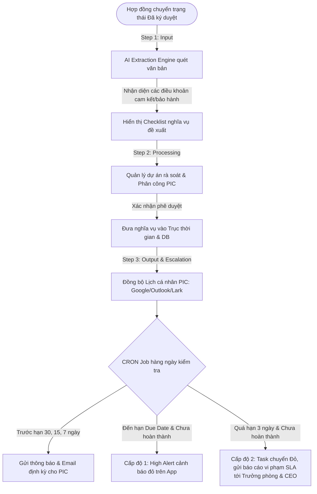
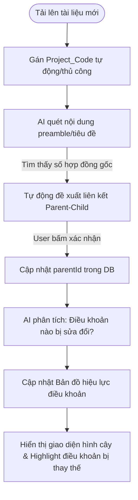
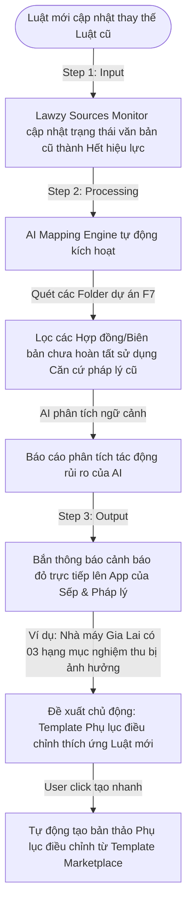

# Kế Hoạch Phát Triển & Thiết Kế Giải Pháp (Project Planning & Solutions Architecture)
## Các Tính Năng Nâng Cấp Hạng Enterprise — LAWZY

Bản kế hoạch này được thiết lập bởi **Solutions Architect** kiêm **Project Manager** của dự án LAWZY. Mục tiêu là lập phương án kiến trúc chi tiết, tận dụng tối đa các thành phần reusable hiện có trong codebase để hiện thực hóa các tính năng Enterprise (tập trung chi tiết vào F6 và F8) với chi phí phát triển tối ưu nhất.

---

## F4: RBAC + Audit Log (Clause-level Redaction & Immutable Log)

### 1. Tóm tắt giải pháp (Technical Approach)
*   **Tác động Backend**: 
    *   Cập nhật [schema.prisma](file:///Users/lyanhquan/code/lawzy/backend/prisma/schema.prisma) để tạo bảng `AuditLog` và cấu hình phân quyền mới.
    *   Tạo Interceptor/Decorator trong NestJS tại `backend/src/modules/documents` để tự động lọc (redact) các block nhạy cảm trong `contentJSON` (ví dụ: các node trong cấu trúc JSON của TipTap mang thuộc tính `isSensitive: true` hoặc `redactionRole: 'admin'`) trước khi gửi về client, dựa trên quyền của user.
    *   Xây dựng cơ chế log chuỗi băm (Hash Chaining) bảo vệ tính bất biến (immutability) của logs: Mỗi log mới lưu mã hash SHA-256 từ `(timestamp + userId + action + details + previous_log_hash)`.
*   **Tác động Frontend**:
    *   Mở rộng TipTap Editor tại [canvas-editor.tsx](file:///Users/lyanhquan/code/lawzy/frontend/src/components/editor/canvas-editor.tsx) để hỗ trợ custom node/mark `RedactedClause`. Node này sẽ hiển thị khối màu đen (redacted) nếu người dùng không đủ quyền, hoặc cho phép bật/tắt hiển thị đối với những người có vai trò phù hợp (Admin/Legal Manager).
    *   Thêm màn hình xem Audit Log trong trang quản trị: `frontend/src/app/(dashboard)/admin/audit-logs`.

### 2. Danh sách các Ticket (Jira-style Tasks)

#### 🎫 LAW-F4-01 (Backend): Cấu trúc DB AuditLog & Thuật toán Hash Chaining
*   **Mô tả**: Thiết lập bảng `AuditLog` trong [schema.prisma](file:///Users/lyanhquan/code/lawzy/backend/prisma/schema.prisma) với các trường: `id`, `userId`, `action`, `details` (JSON), `createdAt`, `previousHash`, `currentHash`. Viết class helper `AuditLogHasher` thực hiện việc băm chuỗi. Xây dựng API `/api/admin/audit-logs` kiểm tra tính toàn vẹn của chuỗi băm và phát hiện bất kỳ sự thay đổi cơ sở dữ liệu trái phép nào.
*   **Tái sử dụng (Reusability)**: 
    *   Kế thừa cấu trúc User relation trong [schema.prisma](file:///Users/lyanhquan/code/lawzy/backend/prisma/schema.prisma#L10).
    *   Sử dụng thư viện mã hóa chuẩn `crypto` có sẵn trong Node.js.
*   **Ước lượng**: 5 Story Points (SP) / 20 Giờ.

#### 🎫 LAW-F4-02 (Backend): Redaction Interceptor cho Tài Liệu Nhạy Cảm
*   **Mô tả**: Viết một NestJS Interceptor mang tên `RedactionInterceptor`. Khi client gửi request lấy nội dung tài liệu (`GET /documents/:id`), interceptor này sẽ chặn kết quả trả về, giải tuần tự hóa `contentJSON` của TipTap, quét tất cả các node. Nếu phát hiện node có attribute `redacted: true` mà user hiện tại (lấy từ request session/JWT) không có quyền `view_sensitive_clauses`, nội dung chữ của node đó sẽ bị thay thế bằng chuỗi ký tự ẩn `[REDACTED]`.
*   **Tái sử dụng (Reusability)**:
    *   Sử dụng `RolesGuard` và logic phân quyền hiện có trong [use-permissions.ts](file:///Users/lyanhquan/code/lawzy/frontend/src/hooks/use-permissions.ts) để đồng bộ hóa logic phân quyền (Backend reuse từ logic RBAC của `WorkspaceMember`).
*   **Ước lượng**: 4 SP / 16 Giờ.

#### 🎫 LAW-F4-03 (Frontend): Custom Node TipTap Redaction trong Editor
*   **Mô tả**: Thêm custom extension `RedactedClause` trong TipTap tại [canvas-editor.tsx](file:///Users/lyanhquan/code/lawzy/frontend/src/components/editor/canvas-editor.tsx). Cung cấp một nút bấm trên bong bóng công cụ (bubble menu) của editor: "Đánh dấu nhạy cảm" (Mark Sensitive) khi bôi đen một đoạn văn bản. Nếu được kích hoạt, đoạn văn bản đó sẽ được bọc bởi class CSS `.bg-black .text-black` (khi chưa giải mật) hoặc có viền đỏ gạch chéo kèm icon khóa đối với Admin.
*   **Tái sử dụng (Reusability)**:
    *   Kế thừa các extension hiện có trong TipTap tại `frontend/src/lib/tiptap` hoặc các extension placeholder trong [canvas-editor.tsx](file:///Users/lyanhquan/code/lawzy/frontend/src/components/editor/canvas-editor.tsx).
    *   Sử dụng các component UI nền tảng như `Tooltip` và `Button` từ [button.tsx](file:///Users/lyanhquan/code/lawzy/frontend/src/components/ui/button.tsx).
*   **Ước lượng**: 5 SP / 24 Giờ.

#### 🎫 LAW-F4-04 (Frontend): Màn hình Quản trị Audit Log Hệ Thống
*   **Mô tả**: Thiết lập giao diện hiển thị danh sách audit log tại đường dẫn `/admin/audit-logs` chỉ dành cho quản trị viên tối cao. Bảng hiển thị các cột: Thời gian, Nhân sự, Hành động, Thiết bị/IP, và Trạng thái Hash (Hợp lệ / Bị giả mạo - hiển thị cảnh báo đỏ nổi bật).
*   **Tái sử dụng (Reusability)**:
    *   Tái sử dụng Table primitive từ [table.tsx](file:///Users/lyanhquan/code/lawzy/frontend/src/components/ui/table.tsx) và DatePicker từ `frontend/src/components/date-picker.tsx`.
    *   Sử dụng API Client `api` tại [client.ts](file:///Users/lyanhquan/code/lawzy/frontend/src/lib/api/client.ts) để gọi data.
*   **Ước lượng**: 3 SP / 12 Giờ.

---

## F5: Dashboard Tracking (Conditional Approval Routing & SLA Analytics)

### 1. Tóm tắt giải pháp (Technical Approach)
*   **Tác động Backend**:
    *   Thêm các bảng mới: `ApprovalWorkflow`, `ApprovalStep`, và `ApprovalAction` vào Prisma schema để quản lý cấu hình các luồng phê duyệt và ghi nhận lịch sử duyệt tài liệu.
    *   Tạo Module `approvals` chứa Service thẩm định điều kiện (Rule Engine) dùng để đánh giá tài liệu sau khi soạn thảo xong: Nếu tài liệu có giá trị tài chính lớn hơn 500 triệu VND (được đọc tự động từ `mergeFieldValues` hoặc metadata), hoặc có mức độ rủi ro là `high` (do AI gắn), hệ thống sẽ kích hoạt phê duyệt theo luồng điều kiện (Conditional Routing).
    *   Ghi nhận timestamps cho mỗi bước duyệt để làm nền tảng tính toán thời hạn SLA xử lý.
*   **Tác động Frontend**:
    *   Tích hợp panel trạng thái phê duyệt trực quan trong Sidebar hoặc [right-panel.tsx](file:///Users/lyanhquan/code/lawzy/frontend/src/components/editor/right-panel.tsx) của trình soạn thảo.
    *   Xây dựng báo cáo SLA Analytics hiển thị các biểu đồ hiệu suất làm việc của phòng ban tại trang `/dashboard/sla`.

### 2. Danh sách các Ticket (Jira-style Tasks)

#### 🎫 LAW-F5-01 (Backend): DB Schema & Cấu Hình Rule Engine Phê Duyệt Điều Kiện
*   **Mô tả**: Thiết lập cơ sở dữ liệu cho luồng phê duyệt trong Prisma. Viết service `ApprovalRoutingService` đánh giá tài liệu dựa trên các quy tắc cấu hình động. Ví dụ, cấu hình:
    `if document.metadata.riskLevel == 'high' -> addStep(Legal_Director)` hoặc 
    `if document.mergeFieldValues.contract_value > 500000000 -> addStep(CFO)`.
    Tự động chuyển đổi trạng thái Document sang `under_review` khi bắt đầu gửi duyệt.
*   **Tái sử dụng (Reusability)**:
    *   Đọc `mergeFieldValues` và `metadata` của `Document` hiện có trong schema Prisma để làm đầu vào cho Rule Engine.
*   **Ước lượng**: 5 SP / 20 Giờ.

#### 🎫 LAW-F5-02 (Backend): SLA Metrics Generator API
*   **Mô tả**: Viết service tính toán thời gian xử lý thực tế của từng bước duyệt: `SLA_Duration = approvedAt - assignedAt`. Tổng hợp các chỉ số: Thời gian duyệt trung bình, tỷ lệ hoàn thành đúng hạn (SLA Met %), và danh sách các tài liệu bị quá hạn (Overdue) để xuất ra API phục vụ Dashboard.
*   **Tái sử dụng (Reusability)**:
    *   Kế thừa cách thức viết Query, cấu trúc tham số `buildQueryString` và cache `staleTime` từ file [use-dashboard.ts](file:///Users/lyanhquan/code/lawzy/frontend/src/hooks/use-dashboard.ts).
*   **Ước lượng**: 4 SP / 16 Giờ.

#### 🎫 LAW-F5-03 (Frontend): Panel Duyệt Hợp Đồng Ở Editor Right Panel
*   **Mô tả**: Xây dựng UI trong [right-panel.tsx](file:///Users/lyanhquan/code/lawzy/frontend/src/components/editor/right-panel.tsx) hiển thị các bước duyệt hiện tại của hợp đồng dạng quy trình thời gian (Timeline). Người dùng có quyền duyệt sẽ thấy 2 nút **[Phê duyệt]** và **[Từ chối]** kèm ô nhập lý do.
*   **Tái sử dụng (Reusability)**:
    *   Sử dụng UI Dialog từ [dialog.tsx](file:///Users/lyanhquan/code/lawzy/frontend/src/components/ui/dialog.tsx) làm modal nhập lý do từ chối.
    *   Sử dụng `useAuthStore` để xác định danh tính và quyền hạn của người dùng đang thao tác.
*   **Ước lượng**: 4 SP / 18 Giờ.

#### 🎫 LAW-F5-04 (Frontend): Dashboard SLA & Performance Charts
*   **Mô tả**: Xây dựng trang `/dashboard/sla` chứa các biểu đồ thống kê: Biểu đồ cột (Bar Chart) biểu diễn thời gian xử lý trung bình theo phòng ban, Biểu đồ tròn (Pie Chart) biểu diễn tỷ lệ đạt/trượt SLA.
*   **Tái sử dụng (Reusability)**:
    *   Kế thừa và tái sử dụng component vẽ biểu đồ [overview-chart.tsx](file:///Users/lyanhquan/code/lawzy/frontend/src/components/dashboard/overview-chart.tsx) (sử dụng Recharts).
    *   Tái sử dụng cấu trúc layout của dashboard chính tại [page.tsx](file:///Users/lyanhquan/code/lawzy/frontend/src/app/(dashboard)/dashboard/page.tsx).
*   **Ước lượng**: 4 SP / 16 Giờ.

---

## F6: Theo Dõi Nghĩa Vụ Tự Động (Obligation Management Engine)

### 1. Tóm tắt giải pháp (Technical Approach)
*   **Tác động Backend**:
    *   Tạo bảng `Obligation` trong [schema.prisma](file:///Users/lyanhquan/code/lawzy/backend/prisma/schema.prisma) để hỗ trợ các trường dữ liệu nghĩa vụ tài chính và phi tài chính.
    *   Tích hợp AI Engine: Khi tài liệu được chuyển trạng thái sang "Đã ký duyệt" và được lưu vào thư mục dự án tương ứng, backend sẽ gửi nội dung văn bản tới Gemini qua [ai-provider.service.ts](file:///Users/lyanhquan/code/lawzy/backend/src/modules/ai/ai-provider.service.ts) để tự động trích xuất các cam kết tĩnh thành các trường dữ liệu nghĩa vụ động có cấu trúc.
    *   Thiết lập một Node.js Cron Job định kỳ hàng ngày rà soát các nghĩa vụ sắp đến hạn hoặc quá hạn để kích hoạt luồng thông báo leo thang (Escalation Flow).
*   **Tác động Frontend**:
    *   Xây dựng màn hình quản lý nghĩa vụ `/documents/obligations` hiển thị danh sách checklist đề xuất từ AI, cho phép quản lý dự án rà soát, gắn PIC (Người phụ trách) và chuyển trạng thái công việc.
    *   Cung cấp tính năng đồng bộ lịch trình nghĩa vụ lên Google Calendar, Outlook hoặc Lark của PIC qua URL Feed (.ics).

### 2. Kiến Trúc Dữ Liệu Nghĩa Vụ (Obligation Data Schema)

Để hệ thống tự động hóa lịch nhắc, bảng `Obligation` trong database được chia làm 2 nhóm chính dựa trên các trường thông tin:

```prisma
model Obligation {
  id                String       @id @default(uuid())
  documentId        String       @map("document_id")
  title             String
  description       String       @db.Text
  category          String       // 'financial' | 'non_financial'
  status            String       @default("pending") // 'pending' | 'in_progress' | 'completed' | 'overdue' | 'escalated'
  
  // 1. Nhóm Nghĩa vụ Tài chính (Financial)
  amount            Decimal?     @db.Decimal(15, 2)
  percentage        Float?       // Tỷ lệ % thanh toán đợt
  triggerCondition  String?      @db.Text // Ví dụ: "Sau khi ký biên bản nghiệm thu đợt 1"
  
  // 2. Nhóm Nghĩa vụ Phi tài chính (Non-Financial)
  obligationType    String?      // 'warranty' | 'inspection' | 'license_renewal' | 'general'
  effectivePeriod   Int?         // Số tháng hiệu lực (phục vụ vẽ biểu đồ Gantt dài hạn)
  responsibleVendor String?      @map("responsible_vendor") // Nhà cung ứng phụ trách (Subcontractor/Vendor)

  // 3. Quản lý Vận hành & Cảnh báo
  assigneeId        String?      @map("assignee_id") // PIC phụ trách theo dõi trực tiếp
  deadline          DateTime
  escalationStage   Int          @default(0) // 0: Bình thường, 1: High Alert, 2: Leo thang quản lý
  createdAt         DateTime     @default(now()) @map("created_at")
  updatedAt         DateTime     @updatedAt @map("updated_at")

  document          Document     @relation(fields: [documentId], references: [id], onDelete: Cascade)
  assignee          User?        @relation(fields: [assigneeId], references: [id], onDelete: SetNull)

  @@index([documentId])
  @@index([assigneeId])
  @@index([status])
  @@map("obligations")
}
```

### 3. Luồng Vận Hành Chi Tiết (Step-by-Step Workflow)



*   **Bước 1: Trích xuất tự động (Input)**: Ngay khi tài liệu chuyển sang trạng thái "Đã ký", AI Engine tự động đọc cấu trúc văn bản. Ví dụ, tại dự án Gia Lai: AI nhận diện pin mặt trời được bảo hành hiệu suất 20 năm bởi Nhà cung cấp A, thiết bị Inverter được bảo hành kỹ thuật 5 năm kể từ ngày nghiệm thu tổng thể.
*   **Bước 2: Cấu hình và Xác thực Luồng (Processing)**: Giao diện hiển thị danh sách các nghĩa vụ gợi ý. PM rà soát, chỉ định PIC (Person In Charge) và bấm duyệt để chính thức đưa vào Timeline của dự án.
*   **Bước 3: Thực thi luồng nhắc nhở leo thang (Output & Escalation Flow)**: Hệ thống đồng bộ lịch qua giao thức `.ics` lên Google/Outlook/Lark của PIC. CRON Job quản lý thời gian gửi cảnh báo: Tốc độ thường (trước 30, 15, 7 ngày), Cấp độ 1 (Đúng ngày - High Alert trên App), Cấp độ 2 (Trễ 3 ngày - Task chuyển Đỏ và bắn báo cáo lên cấp quản lý).

### 4. Danh sách các Ticket (Jira-style Tasks)

#### 🎫 LAW-F6-01 (Backend): Cấu trúc DB & API Quản Lý Nghĩa Vụ
*   **Mô tả**: Viết script migration cập nhật `schema.prisma` để định nghĩa bảng `Obligation` theo cấu trúc dữ liệu Tài chính/Phi tài chính đã thống nhất. Thiết lập các API endpoints `GET /documents/:id/obligations`, `POST /obligations` (tạo thủ công), `PATCH /obligations/:id` (cập nhật trạng thái, gắn PIC), và `DELETE /obligations/:id`.
*   **Tái sử dụng (Reusability)**:
    *   Tái sử dụng cấu trúc xác thực JWT và bảo mật Workspace membership từ `backend/src/modules/auth` và `workspaces`.
    *   Kế thừa cách thức trả dữ liệu JSON và xử lý lỗi chuẩn từ các module có sẵn như `documents`.
*   **Ước lượng**: 4 SP / 16 Giờ.

#### 🎫 LAW-F6-02 (AI/Backend): AI Extraction Engine trích xuất nghĩa vụ tự động
*   **Mô tả**: Xây dựng service `AIJobObligationService` kết nối với Gemini thông qua [ai-provider.service.ts](file:///Users/lyanhquan/code/lawzy/backend/src/modules/ai/ai-provider.service.ts). Viết system prompt chi tiết để Gemini phân tích văn bản (TipTap contentJSON hoặc raw text) và trích xuất ra các nghĩa vụ đúng định dạng cấu trúc Schema (Financial & Non-Financial), dự đoán ngày đáo hạn tương đối dựa trên ngữ cảnh hợp đồng (ví dụ: 5 năm kể từ ngày nghiệm thu).
*   **Tái sử dụng (Reusability)**:
    *   Tái sử dụng [ai-provider.service.ts](file:///Users/lyanhquan/code/lawzy/backend/src/modules/ai/ai-provider.service.ts) (sử dụng hàm `generateContentWithRetry` tích hợp cơ chế Exponential Backoff).
*   **Ước lượng**: 5 SP / 24 Giờ.

#### 🎫 LAW-F6-03 (Backend): Trình Đồng Bộ Lịch (.ics Feed) & CRON Job Leo Thang (Escalation Engine)
*   **Mô tả**: 
    1. Thiết lập endpoint `/api/obligations/calendar-feed/:token` trả về định dạng dữ liệu iCalendar (.ics) chứa danh sách công việc của PIC để tích hợp trực tiếp vào Outlook/Google Calendar.
    2. Viết NestJS Cron Job quét DB mỗi sáng. Nếu phát hiện trễ hạn 3 ngày và trạng thái nghĩa vụ vẫn chưa hoàn thành, hệ thống tự động sinh báo cáo vi phạm SLA, kích hoạt gửi mail leo thang lên cấp trên và đổi trạng thái nghĩa vụ sang `overdue` (mã màu đỏ).
*   **Tái sử dụng (Reusability)**:
    *   Tái sử dụng module email tại `backend/src/modules/email` và email templates tại [email-templates-seed.ts](file:///Users/lyanhquan/code/lawzy/backend/prisma/email-templates-seed.ts).
*   **Ước lượng**: 5 SP / 20 Giờ.

#### 🎫 LAW-F6-04 (Frontend): Màn hình Phê Duyệt Checklist & Kanban Theo Dõi Nghĩa Vụ
*   **Mô tả**: 
    1. Giao diện phê duyệt trung gian cho phép PM rà soát danh sách nghĩa vụ do AI gợi ý trước khi lưu vào DB.
    2. Giao diện Kanban Board tại `/documents/obligations` hiển thị danh sách nghĩa vụ của Workspace. Cho phép kéo thả cập nhật trạng thái (Chưa thực hiện -> Đang thực hiện -> Hoàn thành), có bộ lọc phân biệt nhanh nghĩa vụ tài chính/phi tài chính, và đánh dấu đỏ nổi bật các thẻ quá hạn.
*   **Tái sử dụng (Reusability)**:
    *   Tái sử dụng UI Table từ [table.tsx](file:///Users/lyanhquan/code/lawzy/frontend/src/components/ui/table.tsx).
    *   Sử dụng `@dnd-kit/core` và `@dnd-kit/sortable` đã cài trong thư viện để tạo các cột Kanban.
    *   Sử dụng UI Badge [badge.tsx](file:///Users/lyanhquan/code/lawzy/frontend/src/components/ui/badge.tsx) để hiển thị trạng thái và độ nghiêm trọng.
*   **Ước lượng**: 5 SP / 24 Giờ.

---

## F7: Hồ Sơ Gắn Theo Dự Án & Quản Lý Phiên Bản (Project-Based & Version Tracking)

### 0. Bối cảnh và pain point
*   **Bối cảnh và pain point:**
    * Hệ thống Linking Map của Lawzy được định hướng như một lớp hạ tầng pháp lý động dành cho các dự án có cấu trúc hồ sơ phức tạp, thay vì chỉ là một công cụ lưu trữ hoặc quản lý tài liệu thông thường. Trong thực tế, một dự án hạ tầng, năng lượng hoặc xây dựng có thể bao gồm hàng trăm hồ sơ pháp lý, hành chính, hợp đồng và tài liệu kỹ thuật khác nhau. Các tài liệu này không tồn tại độc lập mà liên tục phụ thuộc, tác động và kế thừa dữ liệu lẫn nhau xuyên suốt vòng đời của dự án.
    * Tuy nhiên hiện nay phần lớn doanh nghiệp vẫn đang vận hành hệ thống hồ sơ theo cách tĩnh: mỗi văn bản là một file riêng biệt, được chỉnh sửa thủ công, copy-paste dữ liệu qua nhiều biểu mẫu và theo dõi bằng trí nhớ con người hoặc checklist rời rạc. Khi một thông tin thay đổi, ví dụ như tên pháp nhân, công suất dự án, timeline triển khai hoặc phạm vi EPC, đội ngũ vận hành thường phải tự rà soát xem những hồ sơ nào bị ảnh hưởng và cần cập nhật lại. Điều này dẫn đến tình trạng sai lệch dữ liệu, thiếu đồng bộ giữa các văn bản, quên cập nhật downstream document hoặc phát sinh rủi ro compliance trong quá trình làm việc với cơ quan quản lý và đối tác.
    * Linking Map được xây dựng để giải quyết bài toán đó bằng cách biến toàn bộ hệ thống hồ sơ thành một “living legal system” — nơi hệ thống có khả năng hiểu được cấu trúc, trạng thái và mối quan hệ giữa các tài liệu trong cùng một dự án. Thay vì xem hồ sơ là các file độc lập, Lawzy xem mỗi văn bản là một node dữ liệu trong một legal graph động. Hệ thống không chỉ lưu trữ tài liệu mà còn hiểu hồ sơ nào phụ thuộc hồ sơ nào, dữ liệu nào là source of truth, thay đổi nào sẽ tạo ảnh hưởng dây chuyền và workflow nào đang bị tác động.
    * Để thực hiện điều đó, hệ thống cần có khả năng tự động trích xuất dữ liệu pháp lý và vận hành từ tài liệu, bao gồm tên pháp nhân, chủ đầu tư, địa điểm dự án, công suất, timeline, số quyết định, approval reference, điều kiện pháp lý và các metadata quan trọng khác. Sau khi được chuẩn hóa, các dữ liệu này sẽ trở thành một phần của knowledge graph cấp dự án.
    * Từ lớp dữ liệu đó, hệ thống phải hiểu được mối quan hệ giữa các văn bản. Ví dụ hồ sơ môi trường phụ thuộc vào công suất dự án, hợp đồng EPC phụ thuộc vào technical scope đã được phê duyệt, hoặc hợp đồng mua bán điện chỉ có thể được kích hoạt sau khi hoàn tất một chuỗi approval nhất định. Các dependency này cần được duy trì động và liên tục cập nhật theo trạng thái thực tế của dự án.
    * Một trong những năng lực quan trọng nhất của hệ thống là khả năng theo dõi data lineage và change propagation. Hệ thống phải hiểu dữ liệu nào bắt nguồn từ đâu, văn bản nào là nguồn gốc chính thức của thông tin và những tài liệu downstream nào đang kế thừa dữ liệu đó. Khi một thông tin thay đổi, hệ thống cần tự động xác định những hồ sơ nào đang bị ảnh hưởng, workflow nào cần chạy lại, approval nào cần xin lại và văn bản nào cần regenerate hoặc resubmit. Điều này giúp doanh nghiệp không còn phụ thuộc hoàn toàn vào trí nhớ hoặc kinh nghiệm cá nhân để kiểm soát tính đồng bộ của dự án.
    * Song song với đó, hệ thống cần liên tục kiểm tra consistency giữa các tài liệu để phát hiện conflict, mismatch hoặc compliance risk. Ví dụ hệ thống có thể phát hiện tên pháp nhân không đồng nhất giữa các hồ sơ, timeline bị lệch, thông số kỹ thuật conflict hoặc một approval bắt buộc còn thiếu trước khi submit. Thay vì chỉ phản ứng sau khi lỗi xảy ra, Lawzy hướng tới việc proactively cảnh báo rủi ro ngay trong quá trình vận hành hồ sơ.
* **Về bản chất**, Linking Map không còn là một tính năng document management, mà là một lớp “project legal state engine”. Hệ thống luôn hiểu dự án đang ở trạng thái nào, hồ sơ nào đã hoàn tất, hồ sơ nào đang pending, dependency nào chưa được resolve và toàn bộ legal workflow đang vận hành ra sao. Điều này khiến Lawzy không chỉ là một AI drafting tool, mà dần trở thành một legal operating system dành cho các dự án có cấu trúc pháp lý phức tạp như năng lượng, hạ tầng, xây dựng và compliance-heavy enterprise operations.


### 1. Tóm tắt giải pháp (Technical Approach)
*   **Tác động Backend**:
    *   Tạo các bảng `Project` (ràng buộc `@@unique([workspaceId, code])`), `DocumentLink`, `ClauseMapping`, và `MismatchAlert` trong database. Thêm trường liên kết `projectId`, `parentId` và `deletedAt` (hỗ trợ Soft-delete giữ toàn vẹn liên kết) vào model `Document` trong `schema.prisma`.
    *   Xây dựng thuật toán AI khớp thực thể (AI Entity Matching) để quét phần mở đầu của văn bản tải lên, tự động tìm và gợi ý liên kết nó làm Phụ lục (`parentId`) của Hợp đồng chính trong cùng một dự án.
    *   Xây dựng **Bản đồ hiệu lực điều khoản** (Clause Versioning Tree): Sử dụng bảng `ClauseMapping` liên kết các ID điều khoản (UUID). Khi phụ lục được liên kết, AI phân tích các đoạn văn bản sửa đổi (ví dụ: *"Sửa đổi Điều 5..."*) và tự động đánh dấu Node Clause tương ứng trong Hợp đồng gốc là `superseded` (bị thay thế) kèm liên kết ngược tới Phụ lục, đồng thời đưa phiên bản Điều 5 mới trong Phụ lục lên trạng thái `active`.
*   **Tác động Frontend**:
    *   Xây dựng Custom TipTap extension `ClauseExtension` định nghĩa node `clause` block có ID tĩnh (`data-clause-id` dạng UUID) giúp xác định chính xác và bất biến các điều khoản bất kể thay đổi tiêu đề.
    *   Xây dựng giao diện "Cây hồ sơ" (Document Tree View) hiển thị trực quan quan hệ phân cấp các tài liệu trong dự án.
    *   Khi xem hợp đồng chính, các điều khoản đã bị sửa đổi sẽ được phủ một lớp cảnh báo (alert badge). Người dùng click vào sẽ chuyển hướng nhanh hoặc hiển thị popup xem nội dung điều khoản mới nhất ở Phụ lục tương ứng.

### 2. Luồng Vận Hành Chi Tiết (Hierarchical Linking & Versioning)



### 3. Danh sách các Ticket (Jira-style Tasks)

#### 🎫 LAW-F7-01 (Backend): Cập nhật Cấu trúc DB Dự án & Quan hệ Parent-Child
*   **Mô tả**: Viết script migration cập nhật `schema.prisma` để thêm bảng `Project` và cấu hình quan hệ tự tham chiếu (Self-referencing relation) trên model `Document` sử dụng trường `parentId`. Cập nhật các API CRUD Document để tự động gán và lọc tài liệu theo `projectId`.
*   **Tái sử dụng (Reusability)**:
    *   Kế thừa logic quan hệ tự tham chiếu phân cấp từ model `SourceChunk` trong [schema.prisma](file:///Users/lyanhquan/code/lawzy/backend/prisma/schema.prisma#L332) (mối quan hệ `parentId` của chunk cha - con).
*   **Ước lượng**: 3 SP / 12 Giờ.

#### 🎫 LAW-F7-02 (Backend/AI): Trình Quét AI Khớp Thực Thể & Gợi Ý Liên Kết Phụ Lục
*   **Mô tả**: Xây dựng service `ProjectLinkerService`. Khi một tài liệu mới được upload, hệ thống trích xuất text 3 trang đầu tiên và gửi cho Gemini AI phân tích. AI có nhiệm vụ tìm kiếm các cấu trúc văn bản pháp lý chỉ ra mối quan hệ phụ thuộc (ví dụ: *"Căn cứ hợp đồng số..."*, *"Phụ lục của hợp đồng..."*). Từ số hiệu tìm thấy, tiến hành truy vấn DB trong cùng `projectId` để đề xuất `parentId` tương ứng. Trả về đề xuất dạng suggestion alert cho người dùng phê duyệt.
*   **Tái sử dụng (Reusability)**:
    *   Tái sử dụng logic trích xuất text của PDF/DOCX từ `backend/src/modules/source-processing`.
    *   Sử dụng API Client để gửi lệnh phê duyệt đề xuất duyệt liên kết.
*   **Ước lượng**: 5 SP / 20 Giờ.

#### 🎫 LAW-F7-03 (Backend): Clause-Level Mapping Engine (Bản đồ hiệu lực)
*   **Mô tả**: Viết service phân tích điều khoản sửa đổi. Khi phụ lục (Child Document) được xác nhận liên kết, AI sẽ phân tách các mục sửa đổi và ánh xạ trực tiếp đến điều khoản tương ứng của Hợp đồng chính (Parent Document). Cập nhật metadata của các block văn bản trong `Document` gốc để lưu trạng thái sửa đổi (`status: 'superseded'`, `linkToChildId: '...'`).
*   **Tái sử dụng (Reusability)**:
    *   Tái sử dụng cấu trúc lưu trữ metadata của block và versioning có sẵn trong model `DocumentVersion` tại [schema.prisma](file:///Users/lyanhquan/code/lawzy/backend/prisma/schema.prisma#L215).
*   **Ước lượng**: 5 SP / 24 Giờ.

#### 🎫 LAW-F7-04 (Frontend): Giao diện Cây Tài Liệu (Document Tree View Explorer)
*   **Mô tả**: Thiết kế component hiển thị cấu trúc cây tài liệu của dự án tại màn hình dự án. Thay vì một danh sách phẳng, sơ đồ cây sẽ phân cấp rõ: Hợp đồng chính là node gốc, các phụ lục, biên bản nghiệm thu co giãn thụt đầu dòng (indentation) nằm dưới hợp đồng chính.
*   **Tái sử dụng (Reusability)**:
    *   Tái sử dụng và tùy biến cấu trúc cây thư mục phân cấp và các trạng thái hover/click từ [app-sidebar.tsx](file:///Users/lyanhquan/code/lawzy/frontend/src/components/layout/app-sidebar.tsx).
*   **Ước lượng**: 4 SP / 16 Giờ.

#### 🎫 LAW-F7-05 (Frontend): Overlay Bản Đồ Hiệu Lực & Cảnh Báo Điều Khoản Hết Hiệu Lực
*   **Mô tả**: Trong trang chi tiết trình soạn thảo của hợp đồng chính, khi render nội dung TipTap, đối với các đoạn văn bản bị sửa đổi, hệ thống sẽ chèn một Alert Badge màu cam: *"Đã được sửa đổi bởi Phụ lục số X - Xem chi tiết"*. Khi click vào badge sẽ mở Side Sheet hiển thị nội dung so sánh song song giữa điều khoản cũ và điều khoản mới nhất.
*   **Tái sử dụng (Reusability)**:
    *   Tái sử dụng giao diện Sidebar trượt từ [sheet.tsx](file:///Users/lyanhquan/code/lawzy/frontend/src/components/ui/sheet.tsx).
    *   Kế thừa panel hiển thị trích dẫn nguồn từ [citation-panel.tsx](file:///Users/lyanhquan/code/lawzy/frontend/src/components/editor/citation-panel.tsx) để làm cơ sở hiển thị so sánh điều khoản.
*   **Ước lượng**: 5 SP / 22 Giờ.

---

## F8: Alert Văn Bản Pháp Luật Hết Hiệu Lực (Regulatory Compliance Scanning)

### 1. Tóm tắt giải pháp (Technical Approach)
*   **Tác động Backend**:
    *   Tạo bảng `ComplianceAlert` trong [schema.prisma](file:///Users/lyanhquan/code/lawzy/backend/prisma/schema.prisma) để lưu thông tin về các lỗi vi phạm/xung đột pháp lý.
    *   Mở rộng `Source` model có sẵn để hỗ trợ lưu trữ cơ sở dữ liệu luật pháp quốc gia (`scope: 'system'`) kết hợp với trường metadata lưu trữ các "Căn cứ pháp lý áp dụng" (ví dụ: Nghị định 06/2021/NĐ-CP, Luật Đầu tư 2020) của hợp đồng.
    *   Xây dựng API giám sát luật (Lawzy Sources Monitor): Hệ thống liên tục quét dữ liệu từ Cổng thông tin Chính phủ, Thư viện pháp luật để cập nhật trạng thái văn bản pháp luật: **Đang có hiệu lực** $\rightarrow$ **Sắp bị sửa đổi** $\rightarrow$ **Hết hiệu lực**.
    *   Xây dựng AI Mapping Engine chạy background: Khi phát hiện luật mới ban hành thay thế luật cũ, hệ thống tự động tìm kiếm các Hợp đồng đang hoạt động (`status: 'active'`) thuộc các Folder Dự án (F7) có liên kết thẻ Căn cứ pháp lý cũ để tiến hành phân tích tác động rủi ro bằng Gemini.
*   **Tác động Frontend**:
    *   Tạo màn hình Trung tâm Cảnh báo Tuân thủ (Compliance Dashboard) tại `/dashboard/compliance` hiển thị cảnh báo tác động trực tiếp đối với các dự án chưa hoàn tất nghiệm thu.
    *   Tích hợp tính năng chủ động đề xuất tạo nhanh (Generate) Phụ lục hợp đồng điều chỉnh (Amendment) từ kho Template Marketplace của Lawzy khi người dùng nhấn vào thông báo cảnh báo.

### 2. Cơ Chế Kết Nối Dữ Lý Pháp Lý Chéo (Compliance Mapping Architecture)

Hệ thống quản lý việc so khớp chéo thông qua hệ thống **Smart Tags Tracking** liên kết động:

*   **Contract Metadata**: Mỗi `Document` lưu trữ trên hệ thống sẽ được AI tự động nhận diện và gán các nhãn căn cứ pháp luật nền tảng trong `metadata.legalBases` (ví dụ: `["Nghị định 06/2021/NĐ-CP", "Luật Xây dựng 2014"]`).
*   **Lawzy Sources Monitor**: Bảng `Source` hệ thống (`scope: 'system'`) lưu giữ thông tin văn bản pháp luật cùng trạng thái hiệu lực (`status: 'active' | 'superseded_by' | 'expiring'`). Khi trạng thái chuyển sang `superseded_by` (được thay thế bởi luật mới), hệ thống sẽ lấy ID của luật thay thế để quét tất cả các hợp đồng mang tag tương ứng.

```prisma
// Ví dụ cấu trúc metadata.legalBases trong Document
{
  "legalBases": [
    {
      "code": "06/2021/ND-CP",
      "name": "Nghị định 06/2021/NĐ-CP về quản lý chất lượng công trình",
      "status": "expiring", // Đồng bộ trạng thái từ Lawzy Sources Monitor
      "replacedBy": "Nghị định mới [Số hiệu]"
    }
  ]
}
```

### 3. Luồng Vận Hành Chi Tiết (Step-by-Step Workflow)



*   **Bước 1: Nhận diện thay đổi lập pháp (Input)**: Hệ thống ghi nhận văn bản mới thay thế văn bản cũ. Ví dụ: Chính phủ ban hành Nghị định mới thay thế Nghị định 06/2021/NĐ-CP về quản lý chất lượng công trình xây dựng.
*   **Bước 2: Phân tích vùng ảnh hưởng bằng AI (Processing)**: AI Mapping Engine tự động quét toàn bộ Folder Dự án đang vận hành (F7), lọc các hợp đồng, biên bản nghiệm thu chưa hoàn tất đang sử dụng Căn cứ pháp lý cũ làm nền tảng.
*   **Bước 3: Đưa ra báo cáo và Hành động ngăn ngừa (Output)**: Bắn cảnh báo trực tiếp trên UI: *"Nhà máy Gia Lai có 03 hạng mục chưa hoàn tất nghiệm thu (Mục 45, 46, 47) bị ảnh hưởng trực tiếp bởi Nghị định 06 hết hiệu lực"*. Đồng thời, gợi ý biểu mẫu Phụ lục hợp đồng mới nhất (Amendment Template) phù hợp luật mới từ Template Marketplace để người dùng click tạo nhanh bản thảo gửi đối tác, ngăn ngừa rủi ro bị cơ quan chức năng phạt.

### 4. Danh sách các Ticket (Jira-style Tasks)

#### 🎫 LAW-F8-01 (Backend): Cấu Hình Căn Cứ Pháp Lý & Lawzy Sources Monitor
*   **Mô tả**: Thiết lập cơ sở dữ liệu `ComplianceAlert` trong [schema.prisma](file:///Users/lyanhquan/code/lawzy/backend/prisma/schema.prisma). Viết API đồng bộ trạng thái văn bản pháp luật quốc gia, đồng thời bổ sung API tự động gắn tag `legalBases` vào metadata của hợp đồng khi upload.
*   **Tái sử dụng (Reusability)**:
    *   Tái sử dụng pipeline trích xuất văn bản (OCR, Chunking, Embeddings) từ module `source-processing` mô tả trong tài liệu đặc tả nguồn upload [FEATURE-SPEC-USER-UPLOAD-SOURCES.md](file:///Users/lyanhquan/code/lawzy/frontend/docs/FEATURE-SPEC-USER-UPLOAD-SOURCES.md).
*   **Ước lượng**: 4 SP / 16 Giờ.

#### 🎫 LAW-F8-02 (Backend/AI): AI Mapping Engine & Phân Tích Tác Động Rủi Ro
*   **Mô tả**: Xây dựng service `ComplianceScanningService` gọi Gemini qua [ai-provider.service.ts](file:///Users/lyanhquan/code/lawzy/backend/src/modules/ai/ai-provider.service.ts). Tìm kiếm các hợp đồng chưa hoàn thành sử dụng tag luật hết hiệu lực, gọi Gemini phân tích mức độ tác động và đề xuất giải pháp thích ứng.
*   **Tái sử dụng (Reusability)**:
    *   Tái sử dụng class `AiProviderService` từ [ai-provider.service.ts](file:///Users/lyanhquan/code/lawzy/backend/src/modules/ai/ai-provider.service.ts) để gọi mô hình Gemini.
*   **Ước lượng**: 5 SP / 24 Giờ.

#### 🎫 LAW-F8-03 (Frontend): Compliance Warning Center & Khởi Tạo Phụ Lục Nhanh
*   **Mô tả**: Xây dựng trang `/dashboard/compliance` hiển thị cảnh báo đỏ tác động dự án. Tích hợp nút **[Tạo Phụ lục thích ứng]** trên card cảnh báo. Khi nhấn nút, gọi API khởi tạo tài liệu mới từ Template tương ứng trong Template Marketplace của hệ thống và điều hướng user thẳng vào Editor.
*   **Tái sử dụng (Reusability)**:
    *   Tái sử dụng template browser component từ [editor-template-browser.tsx](file:///Users/lyanhquan/code/lawzy/frontend/src/components/editor/editor-template-browser.tsx) để hiển thị danh sách template gợi ý.
    *   Tái sử dụng modal xác nhận từ [save-draft-modal.tsx](file:///Users/lyanhquan/code/lawzy/frontend/src/components/editor/save-draft-modal.tsx).
*   **Ước lượng**: 5 SP / 24 Giờ.

---

## V. Bảng Ma Trận Phối Hợp Nâng Cao (The L-Triad Ecosystem: F6 - F7 - F8)

Để chứng minh sức mạnh của giải pháp cho các khách hàng Enterprise (như doanh nghiệp năng lượng **Green Power**), 3 tính năng **F6**, **F7**, và **F8** không vận hành đơn lẻ mà phối hợp chặt chẽ tạo thành một thế chân kiềng khép kín (The Lawzy Triad Ecosystem).

Dưới đây là ma trận phối hợp vận hành thực tế qua các kịch bản của dự án Nhà máy điện mặt trời Gia Lai:

| Kịch Bản Vận Hành Thực Tế tại Gia Lai | Vai trò của F7 (Hồ Sơ Dự Án Phân Cấp) | Vai trò của F6 (Theo Dõi Nghĩa Vụ) | Vai trò của F8 (Alert Thay Đổi Luật) |
| :--- | :--- | :--- | :--- |
| **Kịch bản 1: Theo dõi thời hạn vận hành thử nghiệm thiết bị và nghiệm thu nhà máy.** | **Gom nhóm và phân cấp dữ liệu**: Định vị "Biên bản nghiệm thu" (Mục 45 - Child) là tài liệu con nằm dưới "Hồ sơ vận hành thử nghiệm" (Mục 47 - Parent) trong sơ đồ hình cây của dự án. | **Đặt lịch và thúc đẩy tiến độ**: Tự động tính toán mốc thời gian thử nghiệm để nhắc nhở PIC hoàn thiện hồ sơ nghiệm thu đúng hạn, ngăn ngừa việc chậm tiến độ phát điện thương mại (SLA). | **Giám sát tuân thủ biểu mẫu**: Bảo đảm biểu mẫu nghiệm thu tại thời điểm nộp lên Sở Xây dựng Gia Lai áp dụng đúng quy định pháp luật mới nhất (Ví dụ: mẫu mới theo Nghị định xây dựng thay thế NĐ 06). |
| **Kịch bản 2: Thay đổi đơn giá mua bán điện theo chính sách mới của Nhà nước.** | **Quản lý phiên bản động**: Tự động lưu vết Phụ lục điều chỉnh giá mới, ghi đè đơn giá cũ của hợp đồng gốc và ẩn hiển thị điều khoản cũ để tránh sử dụng sai thông tin. | **Cập nhật dòng tiền tài chính**: Tự động điều chỉnh số tiền ở các đợt thanh toán kế tiếp trên Dashboard Kế toán theo đơn giá mới của phụ lục vừa ký mà không cần nhập thủ công. | **Kích hoạt quy trình sửa đổi**: Phát hiện chính sách giá điện Feed-in Tariff mới thay đổi, tự động khoanh vùng các hợp đồng mua bán điện của nhà máy Gia Lai chịu ảnh hưởng và đề xuất luồng tạo phụ lục. |

---

## VI. Bảng Tổng Hợp Roadmap & Độ Ưu Tiên Phát Triển

Roadmap phân bổ phát triển dưới đây được tính toán dựa trên mức độ phức tạp khi tích hợp vào codebase thực tế của Lawzy:

| Mã | Tính Năng Enterprise | Độ Khó Tích Hợp | Độ Ưu Tiên | Ước Lượng Tổng (SP) | Lý Do Phân Bổ / Ghi Chú |
| :--- | :--- | :--- | :--- | :--- | :--- |
| **F7** | Hồ sơ gắn theo dự án & Quản lý phiên bản | **High** | **High** | 22 SP | Đây là tính năng cốt lõi giải quyết bài toán quản trị vòng đời hợp đồng thực tế của khách hàng doanh nghiệp. Tác động lớn đến cấu trúc DB và trải nghiệm hiển thị cây thư mục. |
| **F6** | Theo dõi nghĩa vụ tự động | **Medium** | **High** | 19 SP | **(Đã Enrich)** Giá trị ROI cực cao cho doanh nghiệp nhờ cảnh báo trễ hạn. Tận dụng tốt email module sẵn có và API của Gemini. Tích hợp đồng bộ calendar PIC. |
| **F4** | RBAC + Audit Log | **Medium** | **Medium** | 17 SP | Đảm bảo tính bảo mật cho doanh nghiệp lớn. Dễ tích hợp do đã có sẵn nền tảng RBAC, chỉ bổ sung thuật toán băm chuỗi và custom node TipTap. |
| **F8** | Alert văn bản pháp luật hết hiệu lực | **High** | **Medium** | 14 SP | **(Đã Enrich)** Đòi hỏi tài nguyên AI quét định kỳ lớn và dữ liệu văn bản luật hệ thống phải chuẩn hóa. Tận dụng hoàn toàn pipeline RAG hiện tại. |
| **F5** | Dashboard Tracking (SLA + Approvals) | **Low** | **Low** | 16 SP | Độ khó kỹ thuật thấp nhất, chủ yếu là CRUD workflow và vẽ biểu đồ Recharts dựa trên dữ liệu SLA tổng hợp. |
