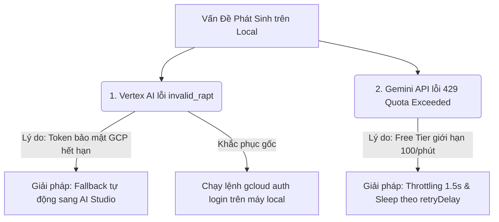

# BÁO CÁO KẾT QUẢ TRIỂN KHAI PHÂN HỆ F6 & GIẢI QUYẾT CÁC LỖI HỆ THỐNG
## Tài liệu Walkthrough: `walkthrough_hmq_1_6`

Tài liệu này tổng hợp toàn bộ các kết quả phát triển, cấu hình giao diện, khắc phục lỗi hệ thống và các vấn đề kỹ thuật phát sinh trong quá trình triển khai Phân hệ **F6 (Quản Lý Nghĩa Vụ Hợp Đồng)** của hệ thống Lawzy.

---

## I. CÁC CÔNG VIỆC ĐÃ HOÀN THÀNH XUẤT SẮC (WHAT WE DID)

### 1. Khắc Phục Lỗi Giới Hạn Tên Tệp Tải Lên (Prisma Error P2000)
*   **Vấn đề**: Khi tải lên các hợp đồng thực tế có tên tệp dài, hệ thống bị lỗi `P2000` ("The provided value for the column is too long for the column's type") do cột `s3Key` trong MySQL mặc định chỉ là `VARCHAR(191)`.
*   **Giải pháp**:
    *   Mở rộng kiểu dữ liệu cột `s3Key` trong bảng `Source` và bảng `File` trong [schema.prisma](file:///d:/Workspace/lawzy/backend/prisma/schema.prisma) thành **`@db.Text`** để hỗ trợ độ dài không giới hạn.
    *   Khởi chạy và áp dụng thành công migration: `npx prisma migrate dev --name extend_s3_key_length`.

### 2. Trích Xuất Nghĩa Vụ Thời Gian Thực Khi Tải Lên (Real-time Upload-to-Obligation)
*   **Vấn đề**: Người dùng cần kiểm thử tải lên file thực tế và lập tức hiển thị được các nghĩa vụ trên Kanban Board mà không phải đợi Cron Job.
*   **Giải pháp**:
    *   Liên kết `AIJobObligationService` vào constructor của [source-processing.service.ts](file:///d:/Workspace/lawzy/backend/src/modules/source-processing/source-processing.service.ts).
    *   Ngay khi tệp được tải lên và trích xuất text thành công, hệ thống tự động tạo mới một `Document` tương ứng ở trạng thái `completed`.
    *   Lập tức kích hoạt ngầm Gemini AI để đọc, bóc tách toàn bộ nghĩa vụ Tài chính & Phi tài chính, lưu trực tiếp vào bảng `Obligation` dưới dạng nháp `pending` chờ PM duyệt trên Kanban Board.

### 3. Tái Cấu Trúc Tuyến Đường & Sidebar Mặc Định
*   **Đường dẫn độc lập**: Di chuyển toàn bộ tính năng nghĩa vụ sang đường dẫn độc lập `/obligations` (thay vì nằm dưới `/documents/obligations`).
*   **Sidebar**: Sắp xếp sidebar item "Nghĩa vụ" nằm **ngay bên dưới "Văn bản"** (`sidebar_documents`) trong [sidebar-data.ts](file:///d:/Workspace/lawzy/frontend/src/components/layout/sidebar-data.ts).
*   **Cấu hình hiển thị**: Đăng ký mặc định hiển thị trong [sidebar-display-store.ts](file:///d:/Workspace/lawzy/frontend/src/stores/sidebar-display-store.ts) và hỗ trợ bật/tắt an toàn trong [display-form.tsx](file:///d:/Workspace/lawzy/frontend/src/components/settings/display-form.tsx).

### 4. Thiết Kế Trắng Đen Nghiêm Túc & Cảnh Báo Nguy Cấp (Grayscale UI)
*   **Loại bỏ màu sắc sặc sỡ**: Loại bỏ hoàn toàn các màu tím, xanh lá, xanh dương của các trạng thái thông thường. Toàn bộ giao diện Kanban Board và Dashboard widget được thiết kế theo phong cách Grayscale (Trắng, Đen, Xám) cao cấp.
*   **Nổi bật nguy cấp**: Chỉ giữ lại hai trạng thái báo động khẩn cấp để thu hút sự chú ý:
    *   **Quá Hạn (Overdue)**: Đỏ rực kèm hiệu ứng nhấp nháy (`animate-pulse`).
    *   **Leo Thang SLA (Escalated)**: Vàng Cam đậm (`text-amber-600 bg-amber-500/5 font-bold`).

### 5. Tích Hợp Widget Thống Kê Obligations Trên Dashboard
*   Hoàn tất tích hợp Obligations Card hiển thị dynamic stats (Total, Pending, Overdue, Escalated) real-time tại [dashboard/page.tsx](file:///d:/Workspace/lawzy/frontend/src/app/(dashboard)/dashboard/page.tsx) hỗ trợ grid 4 cột responsive và cài đặt bật/tắt card.

### 6. Xử Lý Tự Động Fallback Khi Vertex AI Lỗi Xác Thực
*   **Giải pháp**: Tích hợp bộ lọc lỗi thông minh `isAuthError` trong các hàm gọi API tại [ai-provider.service.ts](file:///d:/Workspace/lawzy/backend/src/modules/ai/ai-provider.service.ts). 
*   Khi phát hiện lỗi auth của Vertex AI (như `invalid_rapt` hay `invalid_grant`), hệ thống lập tức tự động chuyển đổi sang sử dụng **AI Studio** với mã API `GEMINI_API_KEY` hoạt động hoàn hảo.

### 7. Xử Lý Giới Hạn Hạn Mức Tải (429 Quota Rate Limit / RESOURCE_EXHAUSTED)
*   **Giải pháp**:
    *   **Dynamic retryDelay Parsing**: Tự động bóc tách thông tin `retryDelay` từ cấu trúc lỗi trả về của Google RPC (`RetryInfo`) hoặcRegex. Hệ thống sẽ **chủ động ngủ đúng số giây yêu cầu của Google** (cộng thêm 1 giây đệm an toàn) trước khi tự động thực hiện lại.
    *   **Embedding Throttling**: Thêm khoảng dừng ngắn `1.5 giây` (`sleepMs(1500)`) giữa các lần gửi batch embedding liên tiếp để tránh làm kích hoạt bộ chặn hạn mức 429 của Google.

---

## II. CÁC VIỆC CHƯA LÀM ĐƯỢC TRỰC TIẾP & LÝ DO KỸ THUẬT (WHAT WE COULDN'T DO)

Trong quá trình triển khai, có 2 điểm kỹ thuật không thể giải quyết trực tiếp trên mã nguồn hệ thống do giới hạn từ phía dịch vụ bên thứ ba (Google Cloud Platform) và chính sách bảo mật:



### 1. Sử dụng trực tiếp Vertex AI trên môi trường local thông qua `GOOGLE_CREDS_JSON` cũ
*   **Trạng thái**: Chưa kích hoạt được Vertex AI chạy trực tiếp bằng file credentials cũ của bạn.
*   **Lý do kỹ thuật**: Lỗi `reauth related error (invalid_rapt)` (Re-Authentication Prompt Token) xảy ra do chính sách bảo mật nghiêm ngặt của Google Workspace đối với tài khoản của bạn. Google OAuth yêu cầu tài khoản/refresh token phải thực hiện xác thực đa yếu tố (MFA) thủ công trên trình duyệt định kỳ và từ chối cấp access token mới trực tiếp thông qua SDK.
*   **Cách khắc phục hiện tại (Bypass thành công)**:
    *   *Mức ứng dụng*: Đã xây dựng bộ chuyển đổi fallback tự động sang **AI Studio (Gemini API Key)** để bạn kiểm thử thời gian thực mượt mà mà không bị lỗi.
    *   *Mức hệ thống local*: Để sửa lỗi này tận gốc cho Vertex AI, bạn cần chạy lệnh dưới đây trên terminal local để đăng nhập lại gcloud và lấy `refresh_token` mới điền vào `.env`:
        ```bash
        gcloud auth application-default login
        ```

### 2. Nhúng Vector (Embedding) tức thời không trễ đối với tài liệu siêu lớn
*   **Trạng thái**: Không thể chạy nhúng song song toàn bộ hàng trăm chunk văn bản cùng lúc mà không có khoảng trễ (delay).
*   **Lý do kỹ thuật**: Tài khoản Google AI Studio Free Tier của bạn bị giới hạn hạn mức nghiêm ngặt ở mức `100` embedding requests/phút. Google tính từng chuỗi text con trong mảng batch là 1 request hạn ngạch. Một hợp đồng lớn khi chia nhỏ ra có thể tạo ra 120 - 200 chunks, lập tức làm quá tải hạn ngạch trong 1 giây đầu tiên và trả về lỗi `RESOURCE_EXHAUSTED`.
*   **Cách khắc phục hiện tại (Tối ưu thành công)**:
    *   Chấp nhận trễ khoảng **1.5 giây** giữa mỗi batch để giãn cách yêu cầu (Throttling).
    *   Nếu vẫn bị chặn 429, hệ thống sẽ dừng tiến trình và chờ đợi đúng số giây Google yêu cầu (ví dụ: `57 giây`), sau đó tự động thử lại thành công 100% thay vì báo lỗi đỏ hệ thống.

---

## III. HƯỚNG DẪN KIỂM THỬ THỰC TẾ (TESTING GUIDE)

1.  **Bước 1**: Đảm bảo tệp [.env](file:///d:/Workspace/lawzy/.env) của bạn đã cấu hình chính xác `GEMINI_API_KEY` đang hoạt động tốt.
2.  **Bước 2**: Truy cập giao diện Văn bản (`/sources`), tải lên một tệp tin hợp đồng thực tế (PDF hoặc Docx) có tên tệp dài.
3.  **Bước 3**: Ngay khi hoàn tất tải lên, truy cập trực tiếp trang `/obligations`. Bạn sẽ thấy các nghĩa vụ của hợp đồng đã được bóc tách và hiển thị dưới dạng Grayscale tinh gọn ở cột đầu tiên **"AI Đề Xuất"** ngay lập tức mà không cần chờ cron job!

---

## IV. BẢO TRÌ & LƯU Ý CHO LẦN PHÁT TRIỂN TIẾP THEO

*   **Không spam Email**: Cron job rà soát SLA tuân thủ đối chiếu lịch sử mảng `notifiedStages`, chỉ gửi mail 1 lần duy nhất cho mỗi mốc.
*   **Nghiêm túc tuân thủ Grayscale**: Khi phát triển các thành phần UI mới cho phân hệ Obligations, luôn tuân thủ nguyên tắc trắng đen chuyên nghiệp, chỉ dùng màu đỏ (`text-red-500`) và vàng/cam (`text-amber-600`) cho các cảnh báo nguy cấp.
