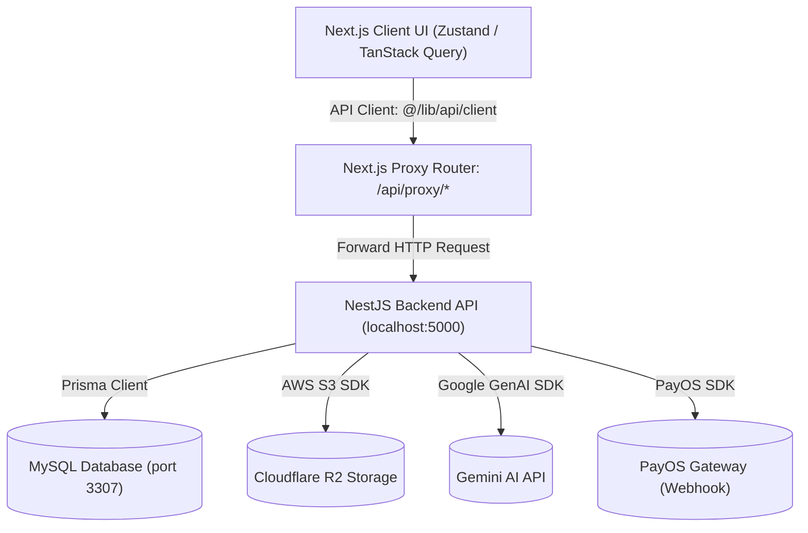
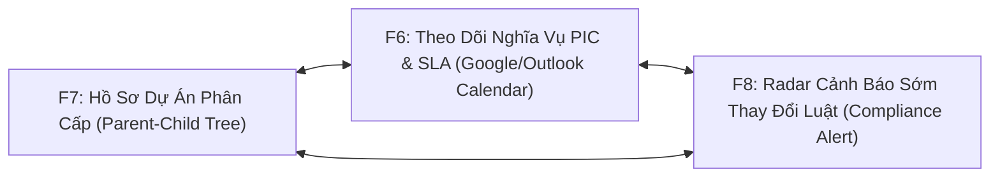

# Báo Cáo Tổng Quan Codebase (Antigravity Scan) — Dự án LAWZY

Báo cáo này cung cấp cái nhìn toàn cảnh về kiến trúc hệ thống, danh sách các module và các quy tắc lập trình cốt lõi trong repository **LAWZY**. Báo cáo được thiết kế trực quan và ngắn gọn giúp bạn nhanh chóng nắm bắt dự án để bắt tay vào code các tính năng mới mà không lo trùng lặp hay phá vỡ cấu trúc sẵn có.

---

## 1. Kiến Trúc Hệ Thống Sơ Bộ (High-level Architecture)

### 1.1 Mô hình Kiến trúc
Hệ thống LAWZY được xây dựng theo mô hình **Monorepo** chia làm hai phần chính:
*   **Frontend (Next.js App Router)**: Đảm nhiệm phần giao diện người dùng, quản lý state client-side, i18n, các micro-animations và soạn thảo hợp đồng thời gian thực (qua editor TipTap).
*   **Backend (NestJS API)**: API server thiết kế theo kiến trúc Modular, chịu trách nhiệm xử lý nghiệp vụ, quản lý cơ sở dữ liệu qua Prisma ORM, tích hợp thanh toán (PayOS), gửi email (Nodemailer), lưu trữ đám mây (Cloudflare R2) và xử lý RAG/AI (Gemini).

### 1.2 Luồng Dữ Liệu Chính (Data Flow)

Dữ liệu đi từ Client UI tới Database thông qua một Next.js API Proxy trung gian để tránh các vấn đề CORS và đơn giản hóa cấu trúc kết nối:



1.  **Client-side Data Fetching**: UI sử dụng **TanStack Query** (react-query) thông qua các custom hooks hoặc gọi trực tiếp wrapper `api` trong `frontend/src/lib/api/client.ts`.
2.  **Next.js Proxy**: Mọi request tới `/api/proxy/*` sẽ được catch-all bởi route `frontend/src/app/api/proxy/[...path]/route.ts` và forward tới NestJS backend chạy ở `BACKEND_URL` (mặc định `http://127.0.0.1:5000`).
3.  **Authentication & Cookies**: Token session (`auth_session` cookie) được đính kèm tự động thông qua cấu hình `credentials: 'include'` trên fetch. Nếu API trả về `401 Unauthorized`, client helper sẽ tự động thực hiện cơ chế token refresh (`POST /auth/refresh`) trước khi thử lại request.
4.  **Database & Storage**: NestJS sử dụng **Prisma ORM** tương tác với MySQL. Các file tài liệu tải lên được đẩy trực tiếp lên Cloudflare R2 thông qua AWS S3 Client SDK.

### 1.3 Tech Stack & Core Libraries

| Tầng | Công nghệ / Thư viện chính | Vai trò / Ghi chú |
| :--- | :--- | :--- |
| **Frontend Framework** | Next.js 16.2.6 & React 19.2.3 | Sử dụng App Router và SSR (Server-Side Rendering) |
| **Styling** | TailwindCSS 4, shadcn/ui, Lucide Icons | Xây dựng giao diện hiện đại, tối ưu tokens và component primitives |
| **Animations** | Framer Motion 12 | Cung cấp các hiệu ứng chuyển trang, micro-animations chuyên nghiệp |
| **State Management** | Zustand 5.0.11 | Quản lý UI state, guest flow, editor session, quota và active workspace |
| **Data Fetching** | TanStack Query v5 | Đồng bộ, caching và revalidate server state ở Client |
| **Form Handling** | React Hook Form & Zod | Validate dữ liệu biểu mẫu chặt chẽ ở Client |
| **Rich Text Editor** | TipTap React Editor | Cốt lõi của trình soạn thảo hợp đồng với các extensions tùy biến |
| **Backend Framework** | NestJS 11.0.1 | Quản lý API modular, DI (Dependency Injection), Guards và Interceptors |
| **Database ORM** | Prisma 6.19.2 | Quản lý cơ sở dữ liệu MySQL, migrates và seeding |
| **AI Integration** | Google GenAI SDK | Hỗ trợ tương tác với Gemini (soạn hợp đồng, trích dẫn RAG, review rủi ro) |

---

## 2. Danh Sách Các Module & Trang (Modules & Pages Breakdown)

Dưới đây là sơ đồ cấu trúc các Trang (Screens) đã được triển khai trên Frontend thuộc 3 nhóm chính: **Landing (Public)**, **Auth**, và **Dashboard (Protected/Private)**.

### 2.1 Nhóm Landing & Public (`(landing)`)
Các trang này nằm ngoài khu vực đăng nhập, tập trung vào giới thiệu sản phẩm và tiếp cận khách hàng.
*   **Trang chủ (`/`)**: Hero section lớn thu hút người dùng, Product Overview giới thiệu 2 dòng sản phẩm CLM & LPMS, cùng CTA cho phép bắt đầu thử soạn thảo ngay (Guest-first flow).
*   **Chi tiết Sản phẩm (`/products/clm` & `/products/lpms`)**: Đặc tả tính năng quản lý vòng đời hợp đồng (CLM) và quản lý văn phòng luật (LPMS).
*   **Bảng giá (`/pricing`)**: Hiển thị các gói thành viên (Free / Pro / Enterprise) lấy dữ liệu trực tiếp từ API.
*   **Tin tức & Điều khoản (`/news`, `/privacy-policy`, `/term`)**: Public CMS cho phép đọc các tin tức mới và điều khoản sử dụng.

### 2.2 Nhóm Xác thực (`(auth)`)
Quản lý luồng đăng nhập, đăng ký và onboard.
*   **Đăng nhập (`/login`)** & **Đăng ký (`/register`)**: Luồng đăng ký gồm 4 bước kết hợp OTP và Onboarding để thu thập thông tin khách hàng.
*   **Quên & Đặt lại mật khẩu (`/forgot-password`, `/reset-password`)**.

### 2.3 Nhóm Dashboard chính (`(dashboard)`)
Đây là phần lõi ứng dụng sau khi người dùng đã đăng nhập (hoặc đang trải nghiệm dưới dạng Guest với các giới hạn về menu cài đặt).

| Module / Route | Tên Trang trong UI | Các Use-case Lớn (Big Use-cases) Đang Đảm Nhiệm |
| :--- | :--- | :--- |
| **`/dashboard`** | Tổng quan | Dashboard hiển thị các số liệu thống kê (tổng hợp tài liệu, file), biểu đồ xu hướng theo khoảng thời gian, thông tin quota AI/Storage, và danh sách các hợp đồng hoạt động gần đây. |
| **`/editor/[id]`** | Trình soạn thảo | Soạn thảo hợp đồng thời gian thực sử dụng TipTap; AI Assistant hỗ trợ generate nội dung hợp đồng, gợi ý điền các merge fields; Quản lý metadata của tài liệu (mức độ rủi ro, tags, chế độ hiển thị); Xem lịch sử phiên bản (versions) và hiển thị các bằng chứng trích dẫn nguồn RAG (Citations Panel). |
| **`/documents`** | Tài liệu của tôi | Quản lý danh sách các hợp đồng trong workspace (bộ lọc tìm kiếm, tag, mức độ rủi ro); Chia sẻ tài liệu ra ngoài; Lưu trữ (Archive) và phục hồi hợp đồng. |
| **`/templates`** | Mẫu hợp đồng | Thư viện mẫu hợp đồng hệ thống (NDA, dịch vụ, lao động...) giúp người dùng chọn nhanh cấu trúc chuẩn để khởi tạo Editor. |
| **`/sources`** | Nguồn pháp lý | Upload tài liệu (PDF, DOCX, TXT) làm nguồn tham chiếu riêng cho Workspace. Kích hoạt pipeline xử lý: trích xuất text, chạy OCR cho tài liệu scan, cắt nhỏ (chunking), tạo embedding và lưu trữ vector phục vụ semantic search khi AI soạn hợp đồng. |
| **`/fields`** | Trường thông tin | Quản lý các trường thông tin động (Merge Fields) dùng chung trong Workspace (ví dụ: Tên công ty, Mã số thuế, Người đại diện) để AI tự động điền vào mẫu hợp đồng. |
| **`/files`** | Quản lý Files | Quản lý danh sách các file upload vật lý (ngoài file nguồn RAG) đính kèm trong các tài liệu. |
| **`/workspace`** | Thành viên | Quản lý cấu hình Workspace; Danh sách thành viên; Mời thành viên mới và phân quyền vai trò (Admin / Editor / Viewer). |
| **`/usage`** | Hạn mức | Theo dõi chi tiết mức độ sử dụng quota AI credits và dung lượng lưu trữ của Workspace. |
| **`/admin/*`** | Quản trị viên | Module dành riêng cho tài khoản có role `admin`, bao gồm: CMS Articles (quản lý bài viết/tin tức), Users/Workspaces administration, inbox feedback, và quản lý các gói cước (`plans`), R2 storage. |

---

## 3. Quy Tắc Code & Thành Phần Tái Sử Dụng (Coding Rules & Reusability)

Để đảm bảo tính nhất quán và chất lượng code cao nhất, bạn cần tuân thủ nghiêm ngặt các quy tắc thiết kế và tận dụng các thành phần sẵn có dưới đây.

### 3.1 Coding Conventions & Design Patterns

*   **Quy tắc đặt tên file & thư mục**:
    *   Thư mục/File route: sử dụng **kebab-case** (ví dụ: `forgot-password`, `app-sidebar.tsx`).
    *   Component: đặt tên theo **PascalCase** (ví dụ: `OverviewChart.tsx`, `QuotaCard.tsx`).
    *   Custom hooks: bắt buộc có tiền tố `use-` (ví dụ: `use-permissions.ts`, `use-navigation-guard.ts`).
*   **Path Aliases**: Luôn dùng `@/*` trỏ tới `frontend/src/*` thay vì import tương đối (ví dụ: `import { api } from "@/lib/api/client"`).
*   **Hydration-safe Zustand Stores**: Khi đọc dữ liệu từ các store có lưu trạng thái trong `sessionStorage` hoặc `localStorage` (như `guest-editor-session-store`), việc đọc trực tiếp có thể gây lỗi hydration mismatch của Next.js.
    *   👉 **Bắt buộc**: Sử dụng helper hook `useStore` từ `frontend/src/lib/zustand/use-store.ts` để trì hoãn việc render client-side cho đến khi mount hoàn tất.
*   **Xử lý Đa ngôn ngữ (i18n)**: Tất cả chữ hiển thị trên UI phải được khai báo trong `frontend/src/lib/i18n/vi.ts` (tiếng Việt) và `en.ts` (tiếng Anh) và truy xuất qua hook `useT()`.
*   **Phân quyền (RBAC)**: Phân quyền truy cập UI sử dụng hook `usePermissions()` và enum `Permission` để kiểm tra quyền hạn của user trong Workspace hiện tại.

### 3.2 Các Reusable Components & Hooks Quan Trọng

Nếu cần viết tính năng mới, bạn **CẦN PHẢI** tái sử dụng các thành phần sau để tránh duplicate code:

#### 1. Core State & Data Stores (`@/stores/*`)
*   `useAuthStore`: Lấy thông tin user hiện tại (`user`), trạng thái đăng nhập (`isAuthenticated`), trạng thái phân giải auth (`authResolved`), và hành động `logout`.
*   `useWorkspaceStore`: Quản lý danh sách workspace, workspace hiện tại (`currentWorkspace`), và trigger fetch workspace.
*   `useGuestEditorSessionStore`: Lưu trữ và phục hồi phiên làm việc của khách (Guest) trong sessionStorage trước khi họ đăng ký/đăng nhập tài khoản.

#### 2. Hooks Nghiệp vụ (`@/hooks/*`)
*   `usePermissions()`: Cung cấp các hàm kiểm tra quyền: `hasPermission(Permission.EDIT_DOCUMENTS)`, `isAdmin()`, `isEditor()`, `isViewer()`.
*   `useT()`: Hook dịch đa ngôn ngữ. Trả về `{ locale, t, setLocale }`.
*   `useStore(store, selector)`: Helper chống hydration mismatch cho Zustand.

#### 3. Client API Wrapper (`@/lib/api/client`)
*   `api`: Chứa các phương thức REST (`get`, `post`, `put`, `patch`, `delete`, `upload`). Sử dụng fetch với credentials mặc định và tự động xử lý refresh token khi gặp lỗi 401. Tránh tự viết `fetch` thô trong component.

#### 4. UI Primitives (`@/components/ui/*`)
*   Toàn bộ shadcn/ui primitives (`Button`, `Dialog`, `Input`, `Select`, `Table`, `Sheet`, `Sidebar`, `Sonner`...) đã được cài đặt sẵn. Luôn import từ `@/components/ui/` thay vì tự tạo component giao diện thô.
*   `DatePicker` (`@/components/date-picker`): Component chọn ngày chuẩn hóa dùng chung.

---

## 4. Hướng Dẫn Vị Trí Đặt Tính Năng Mới (Where to code?)

Khi viết một tính năng mới (ví dụ: `E-Signature` hoặc `AI Clause Analyzer`), hãy tổ chức các file theo cấu trúc phân rã dưới đây:

### 4.1 Cấu trúc trên Frontend (`frontend/src/`)
```
frontend/src/
├── app/
│   └── (dashboard)/
│       └── [feature-name]/       # 1. Các file routes, page.tsx và layout.tsx của tính năng mới
├── components/
│   └── [feature-name]/           # 2. Components chuyên biệt chỉ dùng cho tính năng này
│       ├── feature-card.tsx
│       └── feature-modal.tsx
├── hooks/
│   └── [feature-name]/           # 3. Custom hooks (chứa query TanStack Query hoặc logic riêng)
│       └── use-feature.ts
├── stores/
│   └── [feature-name]-store.ts   # 4. Zustand store quản lý UI state nếu cần share đa màn hình
└── types/
    └── [feature-name].ts         # 5. Khai báo TypeScript types / interfaces cho tính năng
```

### 4.2 Cấu trúc trên Backend (`backend/src/`)
```
backend/src/
└── modules/
    └── [feature-name]/           # 6. NestJS module mới của tính năng
        ├── [feature-name].module.ts
        ├── [feature-name].controller.ts
        ├── [feature-name].service.ts
        └── dto/
            ├── create-[feature-name].dto.ts
            └── update-[feature-name].dto.ts
```
*   Đồng thời, cập nhật Database schema trong `backend/prisma/schema.prisma` và chạy `npx prisma migrate dev` để đồng bộ cơ sở dữ liệu.

---

## 5. Định hướng Tích hợp Hệ Sinh Thái L-Triad (F6 - F7 - F8)

Nhằm chuẩn bị nâng cấp sản phẩm cho đối tác Enterprise lớn (Ví dụ: Doanh nghiệp năng lượng **Green Power**), hệ thống Lawzy định hình thế chân kiềng khép kín gồm ba tính năng: **F6 (Theo dõi nghĩa vụ tự động)**, **F7 (Hồ sơ gắn theo dự án)**, và **F8 (Alert văn bản pháp luật hết hiệu lực)**.



### 5.1 Ma Trận Phối Hợp Hoạt Động (The L-Triad Ecosystem Matrix)

| Kịch Bản Vận Hành Thực Tế tại Gia Lai | Vai trò của F7 (Hồ Sơ Dự Án Phân Cấp) | Vai trò của F6 (Theo Dõi Nghĩa Vụ) | Vai trò của F8 (Alert Thay Đổi Luật) |
| :--- | :--- | :--- | :--- |
| **Kịch bản 1: Theo dõi thời hạn vận hành thử nghiệm thiết bị và nghiệm thu nhà máy.** | **Gom nhóm và phân cấp dữ liệu**: Định vị "Biên bản nghiệm thu" (Mục 45 - Child) là tài liệu con nằm dưới "Hồ sơ vận hành thử nghiệm" (Mục 47 - Parent) trong sơ đồ hình cây của dự án. | **Đặt lịch và thúc đẩy tiến độ**: Tự động tính toán mốc thời gian thử nghiệm để nhắc nhở PIC hoàn thiện hồ sơ nghiệm thu đúng hạn, ngăn ngừa việc chậm tiến độ phát điện thương mại (SLA). | **Giám sát tuân thủ biểu mẫu**: Bảo đảm biểu mẫu nghiệm thu tại thời điểm nộp lên Sở Xây dựng Gia Lai áp dụng đúng quy định pháp luật mới nhất (Ví dụ: mẫu mới theo Nghị định xây dựng thay thế NĐ 06). |
| **Kịch bản 2: Thay đổi đơn giá mua bán điện theo chính sách mới của Nhà nước.** | **Quản lý phiên bản động**: Tự động lưu vết Phụ lục điều chỉnh giá mới, ghi đè đơn giá cũ của hợp đồng gốc và ẩn hiển thị điều khoản cũ để tránh sử dụng sai thông tin. | **Cập nhật dòng tiền tài chính**: Tự động điều chỉnh số tiền ở các đợt thanh toán kế tiếp trên Dashboard Kế toán theo đơn giá mới của phụ lục vừa ký mà không cần nhập thủ công. | **Kích hoạt quy trình sửa đổi**: Phát hiện chính sách giá điện Feed-in Tariff mới thay đổi, tự động khoanh vùng các hợp đồng mua bán điện của nhà máy Gia Lai chịu ảnh hưởng và đề xuất luồng tạo phụ lục. |
