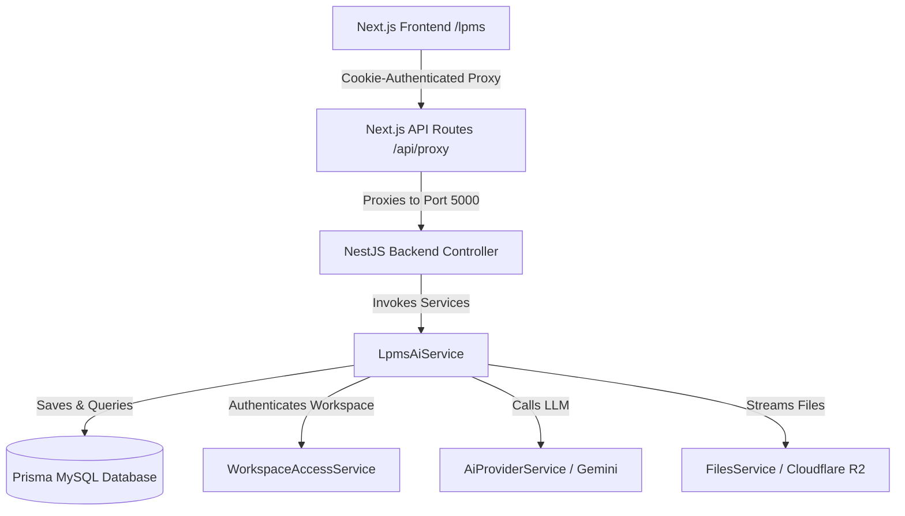

# LPMS Adaptation & Integration Report

This report documents the architectural, backend, and frontend adaptation of features from the **Mike** conversational AI and contract analysis repository into **Lawzy**'s Legal Practice Management System (LPMS).

---

## 1. Architectural Changes Overview

The integration follows **SOLID principles**, migrating from a decoupled Express (Backend) + Next.js (with Supabase Auth) configuration to a consolidated **NestJS (Backend)** and **Next.js (Frontend)** environment using cookie-based session token authentication.

Key features adapted:
1. **Workflows**: Preset and custom prompt configurations for contract parsing.
2. **Tabular Review**: Spreadsheet-style bulk analysis of multiple contracts, including flags (green, grey, yellow, red), cell summaries, and reasoning.
3. **Tabular Chat**: AI Chat scoped to extracted spreadsheet context using Gemini.
4. **General RAG Chat Assistant**: Scope queries against workspace contracts, annotated quotes, and case laws.

---

## 2. Prisma Database & Schema Adaptation

The database was converted from the original PostgreSQL/Supabase schema to Lawzy's standard MySQL database using Prisma. The following models were introduced or adjusted:

- **`LpmsWorkflow`**: Persists prompt configuration for analysis workflows, mapped to the `lpms_workflows` table.
- **`TabularReview`**: Connects a review run to a `Workspace`, `User`, and optionally a `Project`. Maps to `lpms_tabular_reviews`.
- **`TabularCell`**: Tracks the extraction status and parsed JSON content (summary, flag, reasoning) for each intersection of `Document` and `Column`.
- **`TabularReviewChat` & `TabularReviewChatMessage`**: Stores chat histories context-bound to tabular views.

Prisma changes were successfully compiled and pushed via `npx prisma db push`.

---

## 3. Backend (NestJS) Implementation

All AI logic was integrated into a unified module `LpmsAiModule` containing:

### 3.1. `LpmsAiController`
- **Route Namespace**: Prefix `@Controller('lpms')`.
- **Guards**: `@UseGuards(JwtAuthGuard)` to enforce that only verified, logged-in users access endpoints.
- **Actions**:
  - `GET/POST/PATCH/DELETE` for custom workflows.
  - `GET/POST/PATCH/DELETE` for tabular reviews.
  - `POST /tabular-review/:id/clear-cells` & `regenerate-cell`.
  - `POST /tabular-review/:id/generate` (Streams server-sent events (SSE) for bulk extraction).
  - `GET/POST/DELETE` for tabular chats (`/tabular-review/:id/chat` streams LLM replies).
  - `/documents/:id/docx` & `/documents/:id/display` (streams file downloads from S3/R2 storage).

### 3.2. `LpmsAiService`
- **AI Credentials Adaptation**: Migrated from user-provided API keys (OpenAI/Anthropic) to system-wide Gemini credentials. Implemented via Lawzy's system-level `AiProviderService` using Vertex AI / Google AI Studio with exponential backoff retry.
- **Workspace Security**: Wraps all mutations and reads with `WorkspaceAccessService.requireMembership(workspaceId, userId)` ensuring users only interact with data in workspaces they own or belong to.
- **Document Text Fetching**: Integrates with `SourceProcessingService` to automatically extract text from stored docx/pdf attachments in Cloudflare R2.
- **SSE Stream Handler**: Generates cell contents column-by-column. Returns minified JSON results using `responseStream` from the Gemini SDK and writes them directly to the client socket connection.

---

## 4. Frontend (Next.js) Porting & Optimization

The user-facing UI elements were integrated directly into Next.js routing structure:

### 4.1. Route Mappings
- **Tabular Review Dashboard**: Rendered under `/lpms/tabular-analysis`.
- **AI Chat Assistant**: Mounted under `/lpms/assistant` (with dynamic route `/lpms/assistant/chat/[id]`).

### 4.2. API Client & Session Authentication
- Legacy Supabase headers were completely removed. All API interactions route through `/api/proxy` which automatically forwards the cookie `auth_session`.
- Created a mock Supabase client (`frontend/src/lib/supabase.ts`) to prevent compilation errors for legacy libraries using MFA verification or token retrievals, fallbacking sessions to client-cookie authentication.

### 4.3. Library Dependencies & TS Compilation
To enable compilation and visual rendering, we resolved missing packages:
1. Installed `remark-math` and `rehype-katex` for math layout formatting in chat bubbles.
2. Installed `pdfjs-dist` to support PDF client previewers, resolving rendering parameters to support version-compatible signatures.
3. Installed `docx-preview` for real-time DOCX rendering.
4. Installed `exceljs` to enable exporting tables to spreadsheet format.
5. Successfully updated method signatures in `UserProfileContext.tsx` (e.g., `updateModelPreference`) to support dynamic model selections.
6. Wrapped the `LPMSLayout` (`frontend/src/app/lpms/layout.tsx`) in `ChatHistoryProvider` to resolve browser errors regarding missing history contexts.

---

## 5. Verification Results

Both the NestJS backend and Next.js frontend build processes have been executed and checked:
- **Backend Build**: `npm run build` completes with **0 errors**.
- **Frontend Typecheck**: `npx tsc --noEmit` completes with **0 errors**.
- **Dev Servers**: Both servers (`npm run dev` on port 3000, `npm run start:dev` on port 5000) are fully operational.
